# Bosun

Open firmware and a desktop editor for [PaintAudio MIDI Captain](https://paintaudio.com/) foot controllers. Bosun replaces the stock firmware on the pedal with a small, plugin-driven CircuitPython engine, and ships a companion desktop app that lets you configure every switch, screen label and MIDI mapping without touching a text file.

It is built for guitarists who drive a modeller or multi-effect (Kemper Player, Hotone Ampero II Stage, Line 6 Helix, a generic-MIDI device, and anything else you can describe with a plugin) from a 10-switch foot controller and want full control over what each switch does.

---

## Table of contents

- [Genesis of the project](#genesis-of-the-project)
- [How it fits together](#how-it-fits-together)
- [Requirements](#requirements)
- [Quick start](#quick-start)
- [User manual](#user-manual)
  - [Connecting](#connecting)
  - [Home](#home)
  - [Patches](#patches)
  - [Patch editor](#patch-editor)
  - [Quick setup](#quick-setup)
  - [Setlist](#setlist)
  - [MIDI Learn](#midi-learn)
  - [Screen layout](#screen-layout)
  - [Settings](#settings)
  - [Maintenance](#maintenance)
- [Developer guide: writing a plugin](#developer-guide-writing-a-plugin)
- [Building from source](#building-from-source)
- [Project layout](#project-layout)

---

## Genesis of the project

The PaintAudio MIDI Captain is excellent hardware: ten footswitches, a colour TFT, an RGB LED per switch, USB and DIN MIDI. The stock firmware, however, is closed and rigid. Configuring it means editing JSON-like config files by hand, the screen layout is fixed, and the behaviour of each switch is hard to reason about. Projects like [PySwitch](https://github.com/Tunetown/PySwitch) proved the board could run custom CircuitPython, and the hardware pin maps in this repo were originally derived from that work.

Bosun started from a simple goal: make the MIDI Captain feel like a first-class controller for whatever device you actually own, and make it configurable from a real UI instead of a text editor.

That led to three design decisions that shape the whole codebase:

1. **A device-agnostic core.** The firmware engine (`captain`) knows nothing about Kempers or Amperos. It knows switches, bindings, patches, an LED strip and a TFT. Everything device-specific lives in a **plugin**.
2. **Plugins describe themselves.** A plugin is one Python file that declares the message types it understands, their parameters, the screen fields it can fill, and (optionally) a default screen layout and a setup recipe. The firmware streams this self-description (a "manifest") to the editor, so the desktop app builds the right dropdowns and forms for your device without shipping device-specific UI code.
3. **A desktop editor over USB.** Rather than mounting a drive and editing files, the editor talks to the pedal live over a secondary USB serial port using a small line-JSON protocol. You edit a patch, hit save, and the pedal applies it immediately, even while it is in performance mode.

The result is the two halves of this repository: the `firmware/` that runs on the pedal, and the `editor/` desktop application (Tauri + Svelte) that drives it.

## How it fits together

```
+---------------------+         USB CDC (line-JSON)        +-----------------------+
|   Bosun editor      | <--------------------------------> |  MIDI Captain pedal    |
|  (Tauri + Svelte)   |                                    |  CircuitPython         |
|                     |                                    |                        |
|  Patches / Editor   |    manifest (plugin self-desc.)    |  captain (core engine) |
|  Screen layout      | <--------------------------------- |  plugins/ (per device) |
|  MIDI Learn / etc.  |                                    |                        |
+---------------------+                                    +-----------+-----------+
                                                                       | USB / DIN MIDI
                                                                       v
                                                            +----------------------+
                                                            |  Your device         |
                                                            | (Kemper, Ampero, ...)|
                                                            +----------------------+
```

- **`captain`** is the core firmware: switch state machines, the binding runner, LED control, the TFT renderer, persistence and the USB protocol.
- **`plugins/`** holds one module per target device. Each declares the MIDI it can send and the state it can mirror back to the screen and LEDs.
- The **editor** never hard-codes a device. It reads the plugin manifest from the connected pedal and renders the matching controls.

## Requirements

**Pedal**

- A PaintAudio MIDI Captain (10-switch model).
- CircuitPython 9.x. Factory units ship 7.3.3; the editor's setup wizard can flash the right CircuitPython build for you. Bosun uses APIs (`fourwire`) that require CircuitPython 9.

**Editor**

- Windows 11 (the portable build is x64; WebView2 ships with Windows 11).
- Nothing to install for end users: the editor is distributed as an extract-and-run ZIP.

## Quick start

1. Download the latest `Bosun-<version>-portable-x64.zip` and extract it anywhere.
2. Run `Bosun.exe`. No installer, no admin rights.
3. Plug in the pedal over USB.
   - If the pedal still runs stock firmware, the editor detects it and offers to run the **Pedal setup** wizard. Back up your pedal first: installing wipes the factory files (this is destructive and not reversible from inside Bosun).
   - The wizard flashes CircuitPython 9 if needed, then copies the Bosun firmware.
4. Once the firmware is on, the editor connects to the pedal automatically and you land on the Home screen.

> Note on ports: the firmware exposes its protocol on a **secondary** USB serial port, not the REPL console. On Windows you will usually see two `COMx` entries; the editor picks the data port for you. If you only see one port right after an install, power-cycle the USB cable: the data port is enabled by `boot.py`, which only runs on a hard reset.

---

## User manual

### Connecting

When the pedal is flashed and plugged in, the top bar shows **Connected** and the active profile (for example, "Kemper Player"). The profile name is read from the pedal, which loads the matching plugin. The `A- / 150% / A+` control scales the whole UI, and the moon icon toggles light and dark themes.

### Home

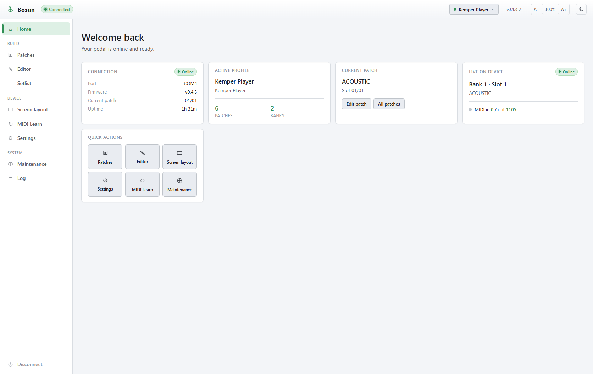

The Home screen is a dashboard:

- **Connection**: the serial port, firmware version, the current patch (bank/slot), and uptime.
- **Active profile**: which plugin profile is loaded, plus how many patches and banks you have.
- **Current patch**: the name and slot of the patch the pedal is on right now.
- **Live mirror**: a compact readout that follows the pedal in real time. When you step a switch on the hardware (or the connected device changes preset), the current bank/slot and patch name update here without a manual refresh, and an activity dot shows the last time the pedal sent anything. It is the fastest way to confirm the editor and pedal are in sync while you work.
- **Quick actions**: shortcuts to Patches, the Editor and the Screen layout.

The left sidebar is the main navigation, grouped by intent: **Build** (Patches, Editor, Setlist) for authoring your sounds, **Device** (Screen layout, MIDI Learn, Settings) for pedal-wide configuration, and **System** (Maintenance, Log) for diagnostics. **Disconnect** at the bottom releases the serial port.

### Patches

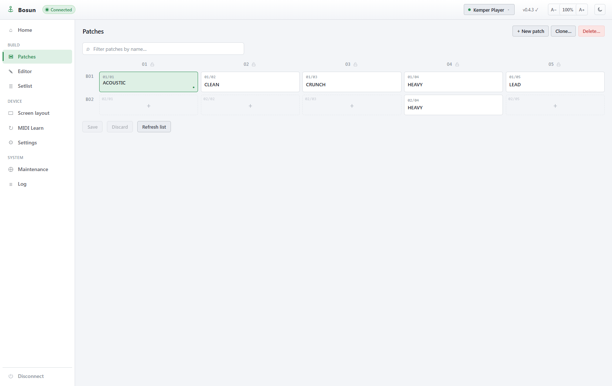

A patch is one full configuration of all ten switches plus the screen. Patches are organised as **banks** (rows, `B01`, `B02`, ...) each with five slots (columns `01`-`05`). The slot the pedal is currently on is highlighted.

From here you can:

- Click a slot to open it in the editor.
- Use **+ New patch** to create one, **Clone...** to copy an existing patch into a free slot, and **Delete...** to remove one.
- Empty slots show a `+` so you can fill them.
- **Save** / **Discard** commit or roll back pending changes, and **Refresh list** re-reads the pedal.

### Patch editor

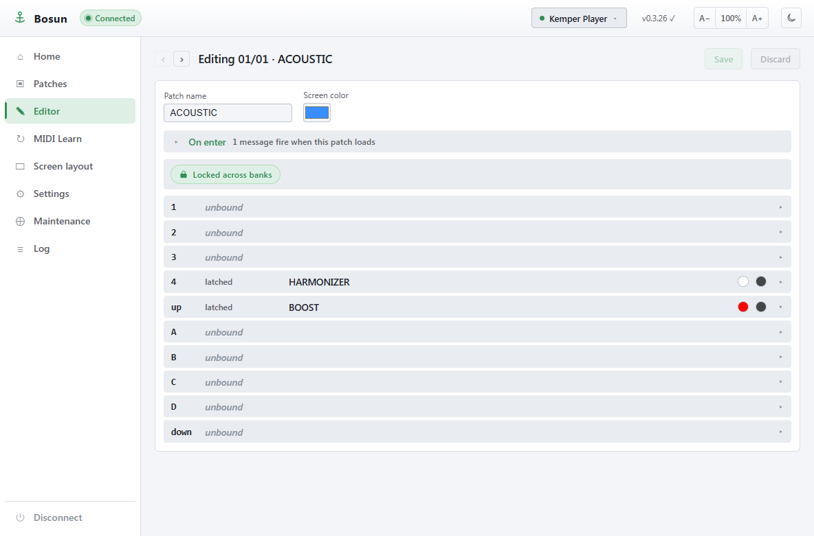

The editor shows the patch name, a TFT colour swatch, and one row per physical switch. The ten rows correspond to the pedal's switches: `1`-`4`, `A`-`D`, and `up` / `down`. Each row shows the switch's mode (for example `tap`, `latched`, `long_press_alt`), its label, and a preview of its LED colours.

Expand a row to configure it in full:

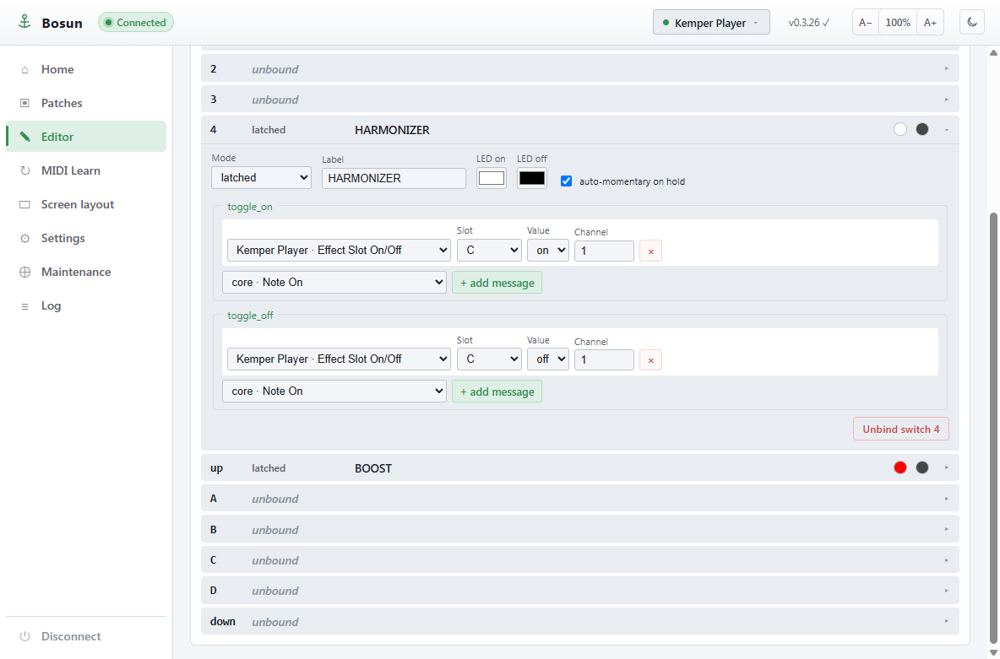

- **Mode** sets the switch behaviour: `tap` (fire once), `latched` (toggle on/off with two macros), momentary, long-press and double-tap variants.
- **Label** is the text shown for the switch.
- **LED on / LED off** pick the colours for each state, and **auto-momentary on hold** lets a latched switch act momentarily while held.
- For a latched switch you build two macros, **toggle_on** and **toggle_off**; for a tap switch you build one. Each macro is a list of messages.
- Add a message with the dropdown. The dropdown is populated from the manifest: **core** messages (`cc`, `pc`, `note_on`, `note_off`, `delay`, `captain_patch`, `captain_bank_step`, and the preset-preview / setlist steps) are always available, and every message type your plugin declares appears alongside them (for example "Kemper Player - Effect Slot On/Off" for the A-D / X / Mod / Delay / Reverb blocks, or "Kemper Player - Fixed Block On/Off" for the input-section compressor, noise gate, pure booster, wah and transpose). The plugin-specific fields (Slot, Value, Channel, ...) come straight from the plugin's schema.

This is the heart of Bosun: a switch press runs a macro, and a macro is just an ordered list of MIDI messages, some core and some expanded by a plugin.

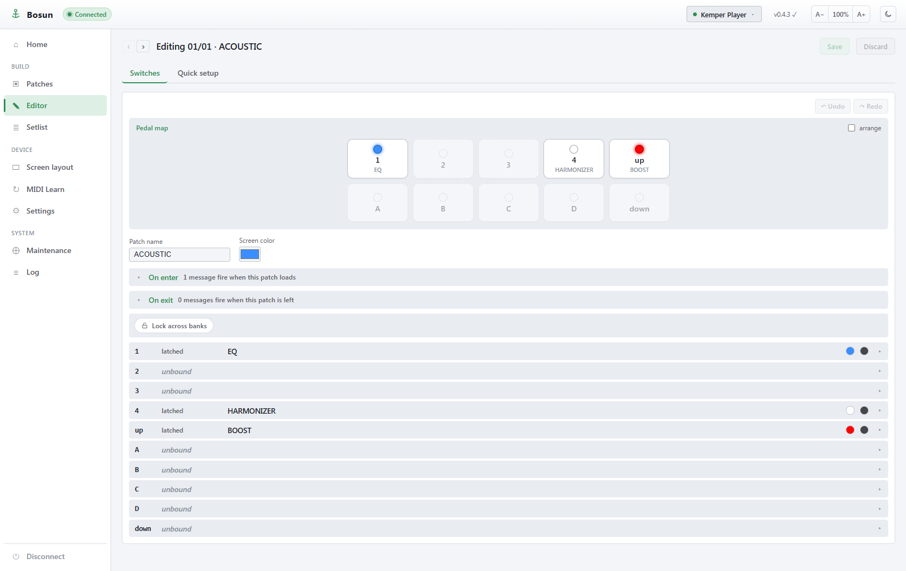

Three editor conveniences sit on top of the switch rows:

- **Pedal map.** A schematic of the ten switches gives you a physical, at-a-glance view of the patch: each switch shows its label and LED colour where it actually sits under your foot, and clicking one jumps to that switch's row. The map is **free-layout**: drag the switches to match how your own pedal is arranged (or how you think about it) rather than a fixed "five on top, five on the bottom" grid. Your arrangement is remembered between sessions.
- **Undo / redo.** Every edit to the open patch (label, mode, LED, messages, colour) is tracked. `Ctrl+Z` undoes and `Ctrl+Y` (or `Ctrl+Shift+Z`) redoes, so you can experiment freely and back out without reloading from the pedal.
- **Snippets.** Configured one switch exactly how you like it? Save it as a reusable snippet, then paste it onto another switch, in this patch or any other, to copy its whole configuration (mode, label, LEDs and macros) in one click. Handy for repeating a "tuner" or "tap tempo" switch across many patches.

Small **help tips** (a `?` next to controls such as Mode) explain the less obvious options inline, so you rarely need to leave the editor to remember what `long_press_alt` or auto-momentary does.

### Quick setup

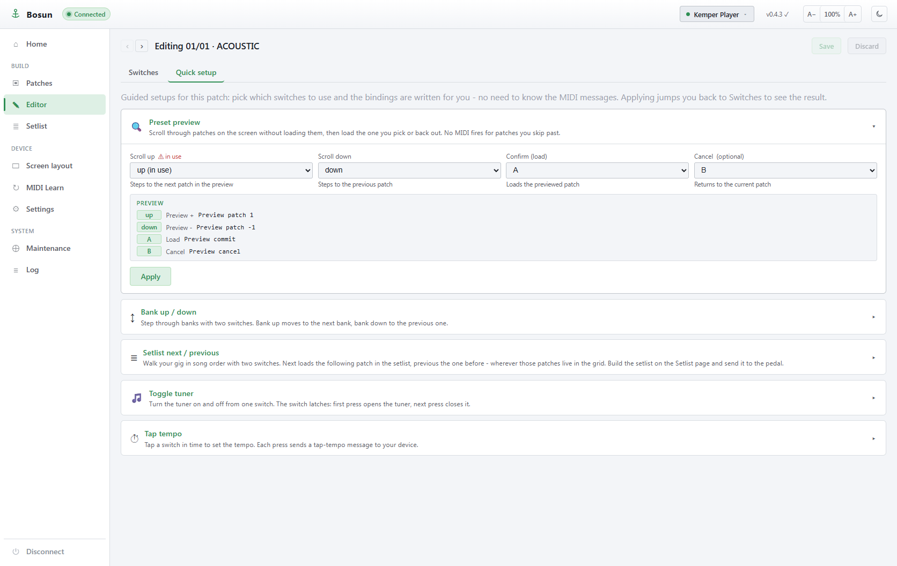

Quick setup is a tab inside the Patch editor (**Switches | Quick setup**), so it always acts on the patch you have open. It writes common switch configurations for you, so you do not have to know the underlying MIDI. Open a patch, switch to the **Quick setup** tab, pick a recipe, choose which physical switches it should use, and the bindings are generated and written straight to the patch. Applying a recipe drops you back to the Switches tab so you see the result.

The built-in recipes include:

- **Preset preview.** Scroll through your patches on the pedal's screen *without loading them*, then confirm the one you land on (or cancel back to where you were). No MIDI fires for the patches you skip past, so the audience never hears you hunting for the right sound. You assign a scroll-up, scroll-down and confirm switch (and optionally a cancel switch).
- **Bank up / down.** Two switches that step through banks.
- **Setlist next / previous.** Two switches that walk your [setlist](#setlist) in song order (see below).
- **Toggle tuner.** One latching switch that opens and closes the tuner. On the pedal, the same tuner also exits the moment you press *any* switch, so a tap of the switch you were reaching for both leaves the tuner and does its job.
- **Tap tempo.** Tap a switch in time to set the tempo.

Recipes that need a plugin feature (tuner, tap tempo) only appear when the active profile's device actually exposes it, so the list you see matches your gear.

### Setlist

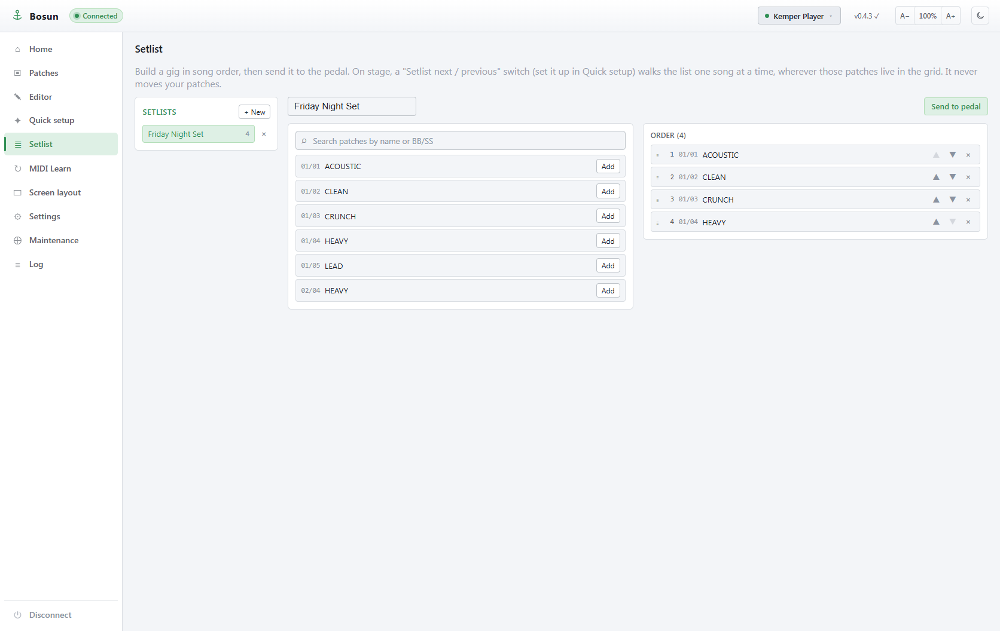

A setlist is an ordered list of patches for a gig, walked one song at a time from a footswitch. It is **non-destructive**: it never moves or renumbers your patches. The order lives alongside them, so the same patch can appear in different setlists in different positions.

Build one on this page:

- Create and name as many setlists as you like (they are saved on your computer).
- Search your patches by name or `BB/SS` id and **Add** them to the current setlist.
- Reorder by dragging, or with the up/down arrows; remove with the `×`.
- **Send to pedal** writes the ordered list to the pedal. An **on pedal** badge shows when the setlist you are viewing matches the one currently loaded on the hardware.

On stage, set up a **Setlist next / previous** pair in [Quick setup](#quick-setup). *Next* loads the following song in the list, *previous* the one before, wherever those patches physically live in the grid, wrapping around at the ends. You can also show your place in the set on the TFT: add the **Setlist position** field (for example `4/12`) in the [Screen layout](#screen-layout) editor.

### MIDI Learn

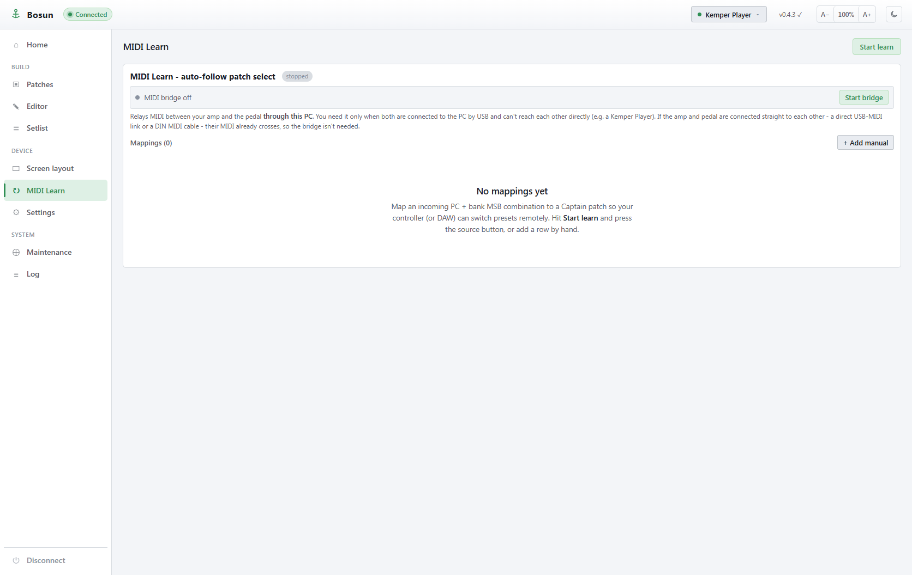

MIDI Learn maps an incoming Program Change (plus bank MSB) to a Bosun patch, so an external controller or a DAW can switch your presets remotely.

- Hit **Start learn**, then press the source button or send the PC; the incoming combination is captured.
- Or use **+ Add manual** to enter a mapping by hand.
- The **bridge** routes a source's MIDI to the pedal over USB when there is no direct DIN path (the Kemper Player, for instance, is USB-MIDI only, so traffic is relayed through the PC).

### Screen layout

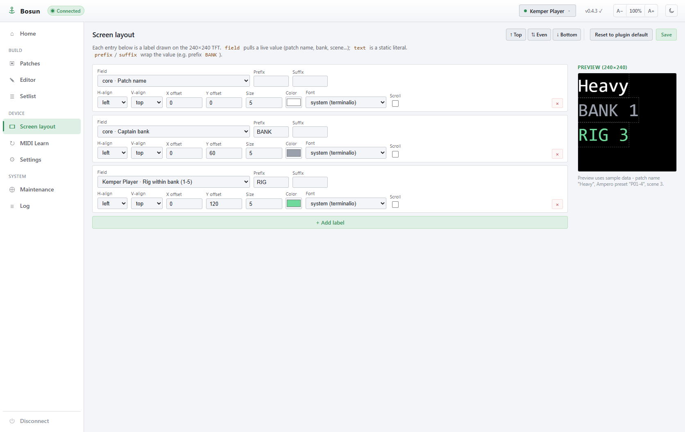

The 240x240 TFT is fully user-defined. Each row here is one label drawn on the screen:

- **Field** pulls a live value. The list mixes **core** fields (patch name, bank, slot, and the [setlist](#setlist) position such as `4/12`) with the fields your plugin exposes (for example "Kemper Player - Rig within bank (1-5)").
- **text** is a static literal, and **prefix** / **suffix** wrap the value (so a `BANK` prefix renders `BANK 1`).
- **H-align / V-align / X offset / Y offset / Size / Color / Font** position and style the label.
- **Scroll** turns a label into a marquee: when its text is wider than the screen it scrolls back and forth instead of being clipped, with an optional **Speed** (pixels per second). Short text that already fits stays still.
- The live **Preview** on the right renders the layout with sample data (scrolling labels animate here too).
- **Reset to plugin default** drops back to the layout the plugin ships, and **Top / Even / Bottom** are quick vertical arrangers.

### Settings

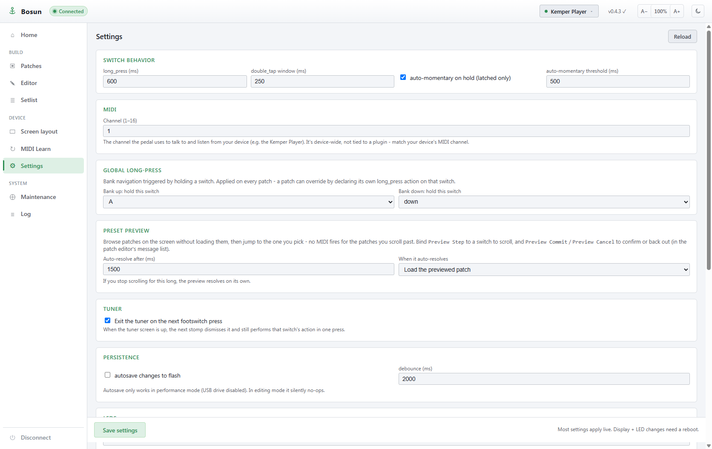

Device-wide behaviour that is not tied to a single patch:

- **Switch behaviour**: long-press time, double-tap window, and the auto-momentary threshold for latched switches.
- **MIDI**: the channel the pedal uses to talk to your device. This is device-wide, not per-plugin, so match your device's channel.
- **Global long-press**: which switch, when held, steps the bank up or down. A patch can override this for a specific switch.
- **Expression pedals**: each of the two jacks can be enabled and mapped to a continuous MIDI control - a plain CC (for example CC 11 expression) or a plugin control such as the Kemper wah, volume or morph pedal. Sweep the pedal heel-to-toe and use **Capture min / Capture max** to calibrate against the live reading, then pick invert and a taper curve (linear / log / exp). The live value is streamed into the mapped message as you move.
- **Persistence / debounce** and similar tuning.

Most settings apply live; display and LED changes need a reboot, as noted at the bottom of the page.

### Maintenance

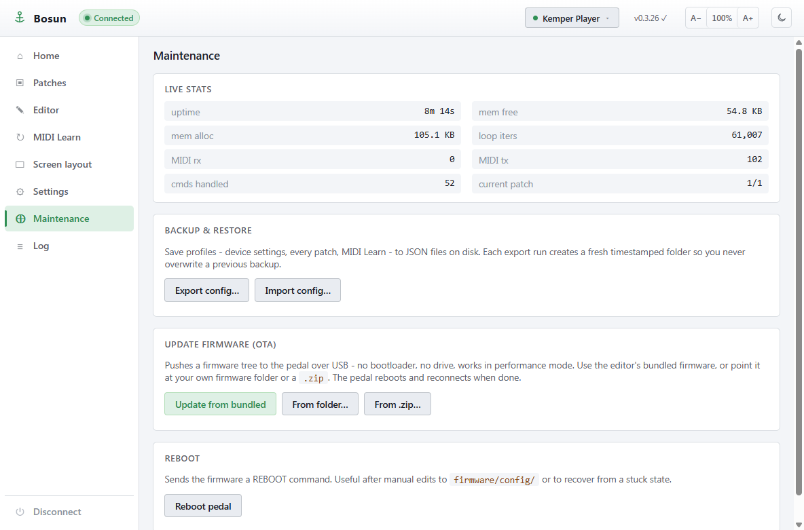

Diagnostics, backup and firmware management:

- **Live stats**: uptime, memory allocated and free, loop iterations, MIDI rx/tx counters, commands handled and current patch. Useful for spotting a hang or a memory leak.
- **Backup & restore**: **Export config...** saves your profiles (device settings, every patch and the MIDI Learn table) to JSON files on disk, each run into a fresh timestamped folder so a backup never overwrites an earlier one. **Import config...** restores them. Take a backup before flashing or installing.
- **Update firmware (OTA)**: pushes a firmware tree to the pedal over USB with no bootloader and no drive mount, and it works in performance mode. **Update from bundled** uses the firmware shipped inside the editor; **From folder...** and **From .zip...** let you point at your own build. The pedal reboots and reconnects when done.
- **Reboot**: sends the pedal a REBOOT command, handy after manual edits to `firmware/config/` or to recover from a stuck state.

---

## Developer guide: writing a plugin

A plugin teaches Bosun how to talk to one target device. It is a single Python module dropped into `firmware/lib/plugins/`. The core discovers it at boot, registers the message types it declares, and streams its self-description to the editor. You do not touch the core or the editor to add a device.

> Core/plugin separation is a hard rule. Device-specific code lives only in `plugins/`; the core (`captain`) stays device-agnostic and must keep working if any plugin is removed.

### The contract

At minimum a plugin must expose:

| Symbol | Purpose |
|---|---|
| `NAME` (str) | Unique identifier, also the profile/device "kind". |
| `MESSAGE_TYPES` (dict) | The message types this plugin adds, with their parameter schemas. |
| `dispatch(msg, midi)` | Expand one plugin message into raw MIDI using the engine. |

Strongly recommended:

| Symbol | Purpose |
|---|---|
| `VERSION` (str) | Plugin version, surfaced in the manifest. |
| `LABEL` (str) | Human-readable device name shown in the editor. |

### Minimal example

```python
# firmware/lib/plugins/mydevice.py

NAME = "mydevice"
VERSION = "1.0"
LABEL = "My Cool Device"

MESSAGE_TYPES = {
    "mydevice_preset": {
        "label": "Select Preset",
        "params": {
            "preset":  {"type": "int", "min": 1, "max": 99, "default": 1, "label": "Preset"},
            "channel": {"type": "int", "min": 1, "max": 16, "default": 1, "label": "Channel"},
        },
        "summary": "Preset {preset}",
    },
}

def dispatch(msg, midi):
    if msg["type"] == "mydevice_preset":
        ch = msg.get("channel", 1)
        midi.send_pc(ch, int(msg["preset"]) - 1)
```

That is enough to make "My Cool Device - Select Preset" appear in the editor's message dropdown, with a Preset and Channel field, and to have a switch press send the right Program Change.

Parameter `type`s the editor understands include `int` (with `min`/`max`), `string` (with optional `pattern`), `enum` (with `values`), and `bool`. A param may carry an `if` clause (for example `"if": {"action": "set"}`) so it only shows when another field has a given value. `summary` is a template the editor uses to render a one-line description of a configured message.

### The MIDI engine API

`dispatch(msg, midi)` receives the engine. The methods you will use:

```python
midi.send_cc(channel, cc, value)         # Control Change
midi.send_pc(channel, program)           # Program Change
midi.send_note_on(channel, note, velocity)
midi.send_note_off(channel, note, velocity)
midi.send_sysex(payload)                 # payload is the bytes between F0 and F7; framing is added for you
```

Channels are 1-16. Look at `plugins/ampero.py` for a clean, complete example (patch select that splits into bank MSB + PC, looper, scenes, tap tempo, tuner) and `plugins/kemper.py` for a larger one (SYSEX, effect-slot toggles, NRPN fixed-block toggles, bidirectional state).

### Optional hooks

Declare any of these functions to opt in; absence is a safe no-op, and a throwing plugin never blocks the others.

| Hook | When it runs | Typical use |
|---|---|---|
| `update_context(msg, ctx)` | After a message you dispatched | Write values into the display context so the TFT can show them. |
| `on_midi_in(port, channel, status, data, app)` | On every incoming MIDI event | Mirror device state (effect on/off, rig number) back to LEDs/screen, or auto-follow the device's own preset changes. |
| `on_patch_loaded(app)` | After a new patch becomes active | Repaint device-mirrored switch LEDs from your own cache. |
| `on_navigate(app, bank, slot)` | A preset switch hit a slot with no Bosun patch | Navigate the device anyway so the whole bank stays reachable. |
| `tick(app, now_ms)` | Every main-loop iteration | Periodic work, for example a keep-alive beacon to a device that only broadcasts while subscribed. |

### Self-description (manifest)

The editor builds its UI entirely from what the plugin declares. Beyond `MESSAGE_TYPES`, you can ship:

- **`TFT_FIELDS`** (dict): named live values your plugin produces, each with a `label` and a `sample` value. These show up as selectable fields in the Screen layout editor. Fill them from `update_context` / `on_midi_in` by writing into the display context.
- **`DEFAULT_LAYOUT`** (list): the screen layout the editor offers via "Reset to plugin default" for this device. Each entry is a label dict (`field`, `x`, `y`, `size`, `color`, `font`, optional `prefix` / `suffix`, alignment).
- **`CONFIG_SCHEMA`** (dict): device-wide options (a `key`, a `label`, and typed `fields`). The editor renders these as a settings block; values are stored under `device[key]` and readable in your hooks via `app.device`.
- **`RECIPE_SCHEMA`** (dict): a declarative "setup" page. It drives a guided walkthrough in the editor (for example, configuring each preset on the device to broadcast its PC for auto-follow) without any device-specific editor code. See the heavily commented block at the bottom of `plugins/ampero.py`.

The registry assembles all of this per plugin and the firmware **streams it field by field** to the editor. This matters: the full manifest is large (around 12 KB) and calling `json.dumps` on it whole will `MemoryError` on the RP2040. If you add to a plugin, keep individual fields modest and let the existing streaming path (`PluginManager.iter_manifest`) do its job; do not introduce code that serialises the whole manifest at once.

### How discovery works

At boot the registry scans `/lib/plugins`, skips anything starting with `_` or `.`, imports each module, and registers it if it has a `NAME`, a `MESSAGE_TYPES`, and a callable `dispatch`. Each message type maps to the plugin that declared it, so the binding runner can route any non-core message to the right plugin. Add a file, reboot (or push firmware from Maintenance), and the new device shows up.

### Checklist for a new plugin

1. Create `firmware/lib/plugins/<name>.py` with `NAME`, `MESSAGE_TYPES`, `dispatch`.
2. Add `VERSION` and `LABEL`.
3. Implement `dispatch` using the engine methods above.
4. Add `update_context` + `TFT_FIELDS` if you want the screen to show device state.
5. Add `on_midi_in` / `on_patch_loaded` if you want LEDs to mirror the device.
6. Ship a `DEFAULT_LAYOUT` so the device has a sensible screen out of the box.
7. Add `CONFIG_SCHEMA` / `RECIPE_SCHEMA` for device-wide options or a guided setup.
8. Push the firmware, reconnect, and confirm your device appears in the editor's dropdowns.

Keep all code, comments and documentation in English, and do not let device-specific logic leak into `captain`.

## Building from source

Full instructions live in [`editor/SETUP.md`](editor/SETUP.md). In short, from `editor/`:

```
npm install                 # JS dependencies
pwsh -File ../tools/download-assets.ps1   # CircuitPython UF2 + bundled libs (one time)
npm run tauri dev           # dev loop with hot reload
npm run package:portable    # build the distributable extract-and-run ZIP
```

You need Node 20+ and the Rust toolchain (install via `rustup`). The editor is a Tauri app: a Svelte + TypeScript frontend over a Rust core that owns the serial connection.

The firmware and editor are always released at the same version. When bumping, change all four in lockstep: `firmware/lib/captain/__init__.py`, `editor/src-tauri/tauri.conf.json`, `editor/src-tauri/Cargo.toml`, and `editor/package.json`.

## Project layout

```
firmware/                 copied to the pedal (CIRCUITPY root)
  boot.py                 enables the dual USB CDC + USB MIDI
  code.py                 entry point
  lib/captain/            device-agnostic core engine
  lib/plugins/            one module per target device (kemper, ampero, ...)
editor/                   Tauri + Svelte desktop app
  src/                    Svelte UI
  src-tauri/              Rust core (serial, installer, firmware push)
  SETUP.md                build and dev instructions
tools/                    install, flash, capture and test scripts (Python + PowerShell)
samples/                  sample profiles
docs/                     plans and UI screenshots
dist/                     packaged portable builds
```

---

Credits: hardware pin maps and protocol groundwork were informed by [PySwitch](https://github.com/Tunetown/PySwitch). Bosun runs on [CircuitPython](https://circuitpython.org/) and [Tauri](https://tauri.app/).
