# Bosun

Bosun turns the 10-switch PaintAudio MIDI Captain into a configurable controller for Kemper Player and generic MIDI devices. Use the desktop or Android app to edit your sounds, and Stage to view the current rig and effects on a tablet, browser or Raspberry Pi display.

The maintained pedal firmware runs natively in C. The supported update target is the RP2040 MIDI Captain with 8 MiB flash.

See the [desktop app screenshots](#desktop-app-screenshots) for Home, patch editing, MIDI Learn and device settings.

## Download and install

Download the package for your system from [GitHub Releases](https://github.com/danmigdev/bosun-midi-captain/releases).

These instructions describe source version **0.6.5**. Until a matching release
is published, use the [desktop build guide](editor/SETUP.md) or
[Android build guide](editor/src-tauri/android-config.md) for the new native
update and Stage features. Keep the app and Pi on matching versions.

| System | Package | Installation |
| --- | --- | --- |
| Windows x64 | `Bosun-<version>-portable-x64.zip` | Extract the whole ZIP and run `Bosun.exe`. |
| macOS, Apple Silicon | `.dmg` | Open it and copy Bosun to Applications. |
| Linux x64 | `.AppImage` | Make it executable, then open it. |
| Android 10 or later | `bosun.apk` | Install the APK and connect using USB-OTG or a Raspberry Pi hub. |

Windows requires WebView2. Allow the Android USB permission prompt when connecting the pedal directly. Use a desktop computer for initial pedal setup and firmware updates.

## Connection options: MIDI Captain, Player, Android, desktop and Raspberry Pi 3 + display

An [editable draw.io overview](docs/diagrams/bosun-connections.drawio) (English, two pages) summarises the wiring and app/network connections.

Bosun uses two connections: **MIDI** carries commands and Player feedback; the **Captain data connection** lets the app edit the pedal and feeds Stage. The Captain's USB cable carries both. With a Pi, the hub shares the data connection with Android, desktop apps and browser displays over the local network.

The Player's **USB-A** socket is a MIDI host for a controller; its **USB-B** socket connects the Player as a MIDI device to Android, a computer or the Pi. See [Kemper's USB port reference](https://www.kemper-amps.com/faqs).

| Setup | Connections | What you can do |
| --- | --- | --- |
| Captain + Player | **Player USB-A ↔ Captain USB-B**, using a USB-A to USB-B data cable. | Play with the Captain and its built-in display. |
| Captain + Android | **Captain USB-B → Android USB host/OTG**, using a data cable and suitable adapter. | Edit the Captain from the Android app; the Player is optional for configuration. |
| Captain + Player + Android | **Player USB-B + Captain USB-B → USB hub → Android USB-OTG**. | Play, edit and view Stage using Android's MIDI bridge. |
| Captain + Player + desktop | **Player USB-B + Captain USB-B → computer USB ports or a USB hub**. | Play, edit and view Stage using Bosun Desktop's MIDI bridge. |
| Captain + Player + Raspberry Pi 3 | **Player USB-B + Captain USB-B → two Pi USB-A ports**. Optional display: **Pi HDMI → display**, plus **separate USB power → display**. | The Pi handles MIDI; add the display for Stage, and Android or desktop over the network for editing. |
| Captain + Player + Pi + Android over Wi-Fi | **Captain + Player → Pi USB ports**, then **Android → existing Wi-Fi LAN or the Pi hotspot**. | The Pi handles MIDI; Android provides editing and Stage wirelessly, alongside an optional HDMI display. |

### 1. Captain directly to Player

Connect **Player USB-A ↔ Captain USB-B** with a USB-A to USB-B data cable. The Player hosts the MIDI connection, so no software bridge is needed. Kemper confirms that this port supports MIDI in both directions, including controller feedback. See [Kemper's explanation of bidirectional USB MIDI](https://forum.kemper-amps.com/forum/thread/63755-fr-kemper-profiler-player-midi-out/?postID=685835).

Use the saved Kemper Player profile on the Captain. To edit it over USB, move its cable to Android or a computer, or use one of the setups below. Connecting Android or the Pi to the Player's other USB port does not expose the Captain's Bosun data connection; this direct setup does not provide an external Bosun Stage display.

### 2. Android over USB, with an optional Player

To configure only the Captain, connect **Captain USB-B → Android USB host/OTG** with a USB data cable and suitable adapter. Install and open `bosun.apk`, select **USB**, accept the USB permission prompt and connect the Captain. A Player and an external USB hub are not required for this connection.

To play, edit and view Stage together on Android, use this wiring:

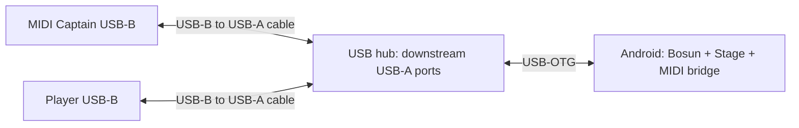
```mermaid
flowchart LR
    Captain["MIDI Captain USB-B"] <-->|"USB-B to USB-A cable"| Hub["USB hub: downstream USB-A ports"]
    Player["Player USB-B"] <-->|"USB-B to USB-A cable"| Hub
    Hub <-->|USB-OTG| Android["Android: Bosun + Stage + MIDI bridge"]
```

Connect the hub's upstream cable to an Android device with USB host/OTG support. Use two USB-A to USB-B data cables to connect the Player and Captain to the hub's downstream ports. Use a powered hub if the phone cannot supply enough power; simultaneous phone charging depends on the phone and hub. Power the Player with its own supply.

Select **USB**, accept Android's USB permission prompts, connect the Captain and check **Bridge ON**. Bosun attempts to start the bridge automatically when both devices are available; tap **Bridge OFF** to start it manually if needed. The bridge forwards MIDI in both directions, including the feedback used for rig names and effect states. Open **Stage** on Android for the live display and touch controls.

Keep Bosun running and Android connected while playing: in this setup Android carries the MIDI traffic. An ordinary USB hub alone does not route MIDI between its devices. Bosun Desktop offers the same arrangement with both devices connected to the computer's USB ports or a hub.

### 3. Captain and Player to Raspberry Pi 3, with an optional display

Install the [Pi hub and Stage services](tools/rpi-hub/README.md), then wire the devices as follows:

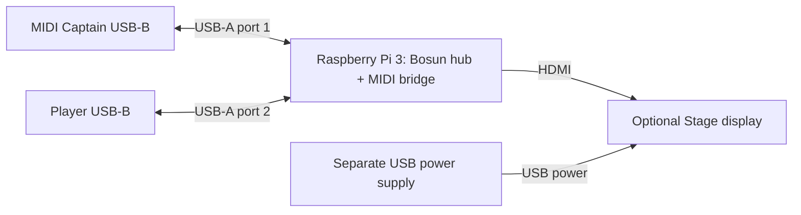
```mermaid
flowchart LR
    Captain["MIDI Captain USB-B"] <-->|"USB-A port 1"| Pi["Raspberry Pi 3: Bosun hub + MIDI bridge"]
    Player["Player USB-B"] <-->|"USB-A port 2"| Pi
    Pi -->|HDMI| Display["Optional Stage display"]
    Power["Separate USB power supply"] -->|"USB power"| Display
```

Use two USB-A to USB-B data cables, one from **Captain USB-B** to a **Pi USB-A** port and one from **Player USB-B** to another **Pi USB-A** port. No external USB hub is needed when these Pi ports are available.

For the optional display, connect **HDMI to the Pi** for video and **USB to a separate power supply** for power. Power the Pi and Player with their own supplies too. If the display has a separate USB touch connection, connect that to another Pi USB port for input.

The Pi automatically connects MIDI in both directions and starts Stage at boot. After installation, this setup works without Android, a computer, a router or internet access. A plain display shows Stage; a touchscreen or connected mouse also lets you operate it. The display is optional: the Pi can run as a MIDI/network hub with Stage shown only in an app or browser.

### 4. Android over Wi-Fi through the Raspberry Pi

Leave the Captain and Player connected to the Pi as in setup 3. Android connects over Wi-Fi and can edit the Captain or show Stage while the Pi runs the MIDI bridge:

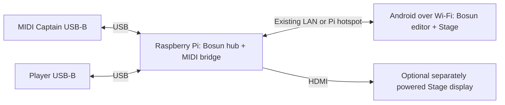
```mermaid
flowchart LR
    Captain["MIDI Captain USB-B"] <-->|USB| Pi["Raspberry Pi: Bosun hub + MIDI bridge"]
    Player["Player USB-B"] <-->|USB| Pi
    Pi <-->|"Existing LAN or Pi hotspot"| Android["Android over Wi-Fi: Bosun editor + Stage"]
    Pi -->|HDMI| Display["Optional separately powered Stage display"]
```

1. Install the [Pi hub](tools/rpi-hub/README.md). For a connection without a router, also configure the [Pi Wi-Fi hotspot](tools/rpi-hub/hotspot/README.md).
2. On Android, join the same Wi-Fi LAN as the Pi, or join the Wi-Fi name and password configured for its hotspot. Keep that connection if Android reports no internet.
3. In Bosun, select **Raspberry Pi (network) → Find Raspberry Pi → Connect**. If discovery fails, enter the Pi's LAN hostname/IP, or **`10.42.0.1`** for the default hotspot, in the host field. Use **`9876`** in the port field.
4. Open the editor to change and save settings, or open **Stage** to view and control the pedal. For Stage in Android's browser, use **`http://YOUR_PI_HOSTNAME:8080/`** on the LAN or **`http://10.42.0.1:8080/`** on the default hotspot.

The phone needs no USB cable in this setup. Closing Bosun or disconnecting Android leaves the Pi's MIDI bridge and optional HDMI Stage display running.

### Connect the Captain to the Android or desktop app

**Both Bosun Android and Bosun Desktop support direct USB, a local network through the Pi, and the Pi's own Wi-Fi hotspot.** The Player is not required just to edit the Captain; connect it using the Android or Pi setup above when you also want to play and receive live Player feedback.

| Connection method | Bosun Android | Bosun Desktop |
| --- | --- | --- |
| **Direct USB** | Connect **Captain USB-B → Android USB host/OTG**, using a data cable and suitable adapter, or the hub in setup 2. Select **USB** and accept the USB permission prompts. | Connect **Captain USB-B → computer USB-A or USB-C** with a suitable data cable. Select **USB**; Bosun selects the Captain's data port automatically. |
| **Local network through Pi** | Leave **Captain USB-B → Pi USB-A** connected. Join the same LAN on Android over Wi-Fi; the Pi can use Wi-Fi or Ethernet. Select **Raspberry Pi (network)** in Bosun. | Leave **Captain USB-B → Pi USB-A** connected. Connect the computer and Pi to the same LAN over Wi-Fi or Ethernet. Select **Raspberry Pi (network)** in Bosun. |
| **Pi Wi-Fi hotspot** | Leave **Captain USB-B → Pi USB-A** connected. Join the Pi's configured Wi-Fi name on Android, then select **Raspberry Pi (network)** in Bosun. | Leave **Captain USB-B → Pi USB-A** connected. Join the Pi's configured Wi-Fi name on the computer, then select **Raspberry Pi (network)** in Bosun. The computer needs Wi-Fi for this connection. |

For either network method, install the [Bosun Pi hub](tools/rpi-hub/README.md) first. In either app, choose **Find Raspberry Pi**, select the Pi and choose **Connect**. If discovery is unavailable, enter the Pi's address and port **`9876`** manually:

- **Existing LAN:** use the Pi's hostname or the IP address assigned on that network.
- **Pi hotspot:** follow the [hotspot setup guide](tools/rpi-hub/hotspot/README.md), join its configured Wi-Fi name/password, then use **`10.42.0.1`**, unless you changed the guide's default address. No separate router or internet connection is required during use.

With the hotspot, keep the phone or computer connected even if it reports no internet. The provided setup dedicates the Pi's built-in Wi-Fi to the hotspot; Ethernet remains available for another network connection.

In both network modes, the Captain stays physically connected to the Pi, and the app can edit/save its configuration and show Stage. With the Player also connected to the Pi, the Pi handles the MIDI bridge. Closing the Android or desktop app leaves MIDI and the optional HDMI Stage display running.

For Stage in a browser, open **`http://YOUR_PI_HOSTNAME:8080/`** on the LAN or **`http://10.42.0.1:8080/`** on the default hotspot. The browser page provides Stage controls; use the Android or desktop app for the full editor. Apps and browser pages can run alongside the Pi display. Appearance settings belong to each app/browser separately. For an exact, read-only view of the Pi's rendered display, use the [VNC viewer](tools/rpi-hub/README.md#view-the-actual-pi-display-on-windows).

### Connection limits and updates

- The Captain's **USB-B** port connects to **one host at a time**: Player USB-A, Android, desktop or Pi. A USB splitter cannot share it between hosts. To access it from an app while it is connected to the Pi, use the LAN or hotspot connection above.
- Bosun connects to the Captain through USB or the Pi network hub. Connecting Android to the Player's Wi-Fi/Bluetooth does not connect Bosun to the Captain, and the Android app does not provide a network hub for a Pi display.
- For Captain firmware updates and migration, use **Bosun Desktop** and follow [Update firmware](#update-firmware) for the supported connection and procedure. Android USB and network connections support editing and Stage, but not these firmware updates.

## Set up the pedal

### A pedal already running Bosun

1. Connect the Captain directly to the computer by USB, or connect it to a [Raspberry Pi hub](tools/rpi-hub/README.md).
2. Open Bosun. For direct USB, the app selects the data port automatically. For a Pi connection, choose **Raspberry Pi (network)**, select **Find Raspberry Pi**, then **Connect**.
3. Create a profile for your device when prompted. Native firmware supports **Kemper Player** and **Generic MIDI**.
4. Open **Patches**, select a bank and rig, and configure its switches. Choose **Save** to keep changes on the pedal.

### First installation from factory firmware

Back up the pedal's original files before installing: the setup wizard can erase them.

Connect the pedal directly to a desktop computer and follow **Install firmware**. The existing wizard prepares a legacy bootstrap installation; it does not install the final native firmware. If automatic detection fails, follow its instructions to enter the pedal's bootloader.

Once Bosun connects, create a supported profile and move the Captain's USB connection to a configured Raspberry Pi. Use **Update Bosun** below to complete the migration to native firmware. The first-install backup remains necessary: the updater's later backup contains the bootstrap installation, not the original factory firmware.

## Configure your sounds

- **Profiles** keep settings for different devices or setups separate.
- **Patches** contains your banks and rigs. Open a rig to assign messages to a switch's press, release or hold action, and set its label and LED colour.
- **Quick setup** applies the available setup recipe for the active profile.
- **Screen layout** changes the Captain's display fields and colours.
- **Settings** contains device-wide options, including expression pedals and preset navigation.
- **Maintenance → Export config…** backs up profiles, settings, patches and MIDI Learn data. **Import config…** restores an exported configuration.

Save edits before disconnecting or updating. **Discard** restores the saved version of pending patch changes.

## Desktop app screenshots

These screenshots show earlier desktop versions. Labels and available actions may differ in the current release; follow [Update firmware](#update-firmware) for the current update procedure.

### Home

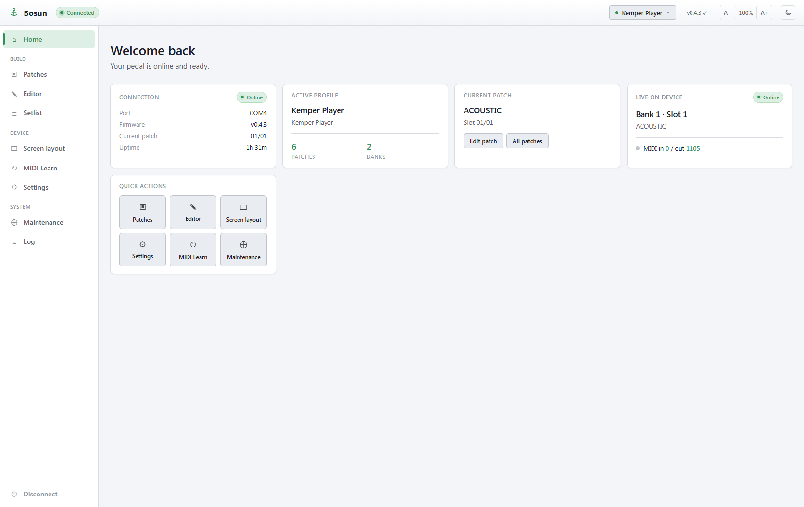

### Patches

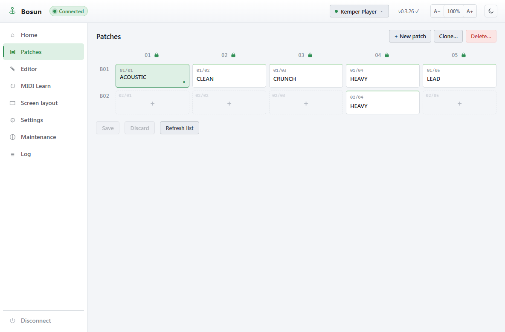

### Patch editor

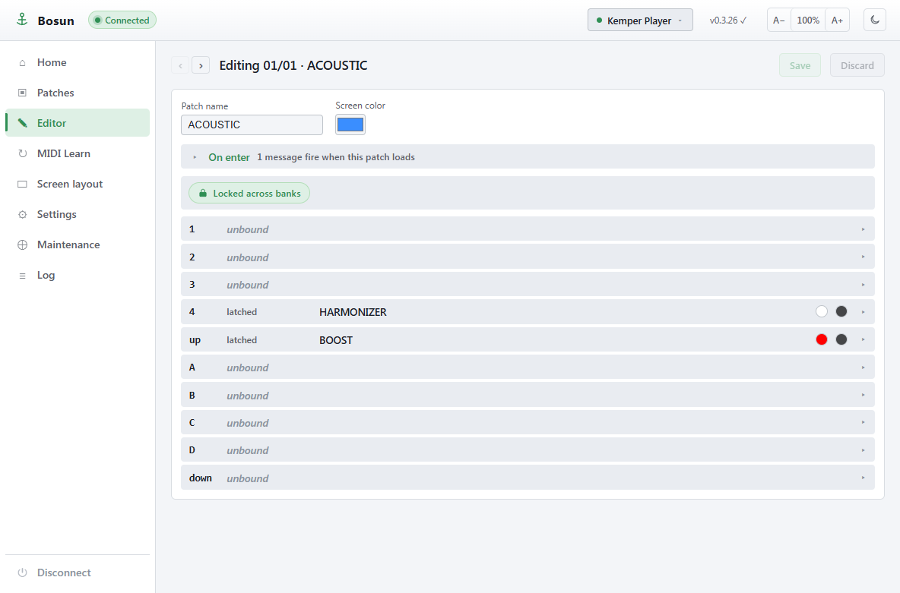

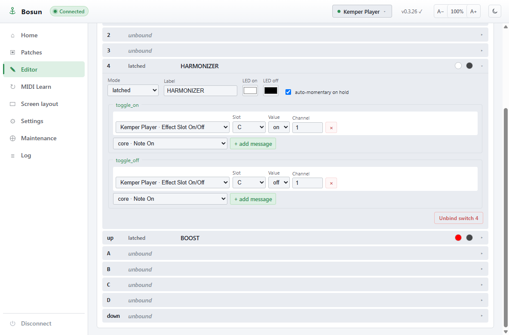

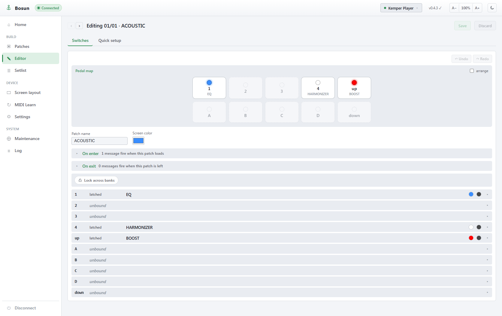

### Quick setup

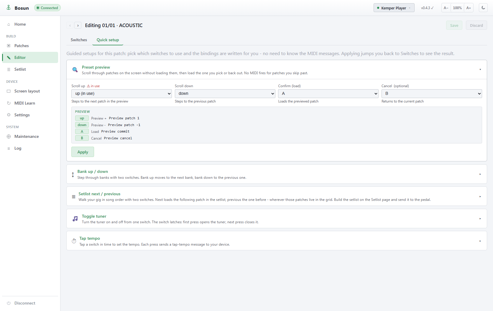

### Setlist

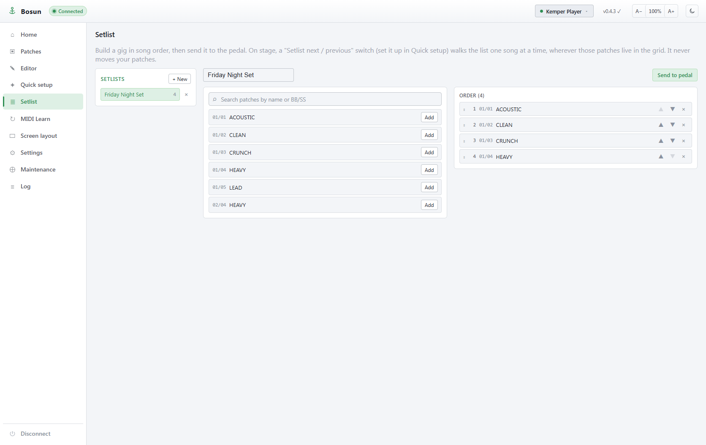

### MIDI Learn

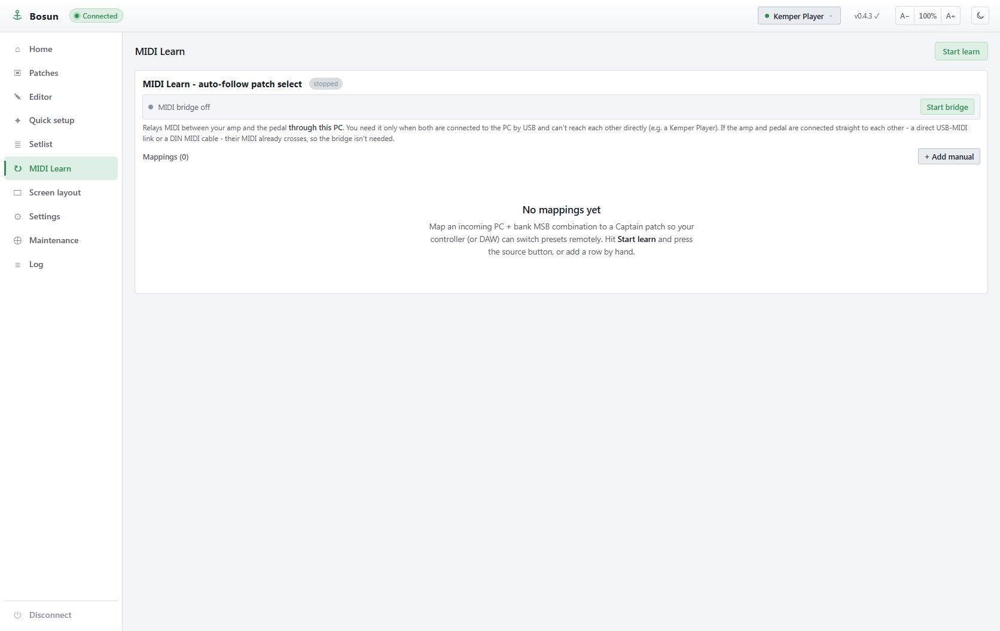

### Screen layout

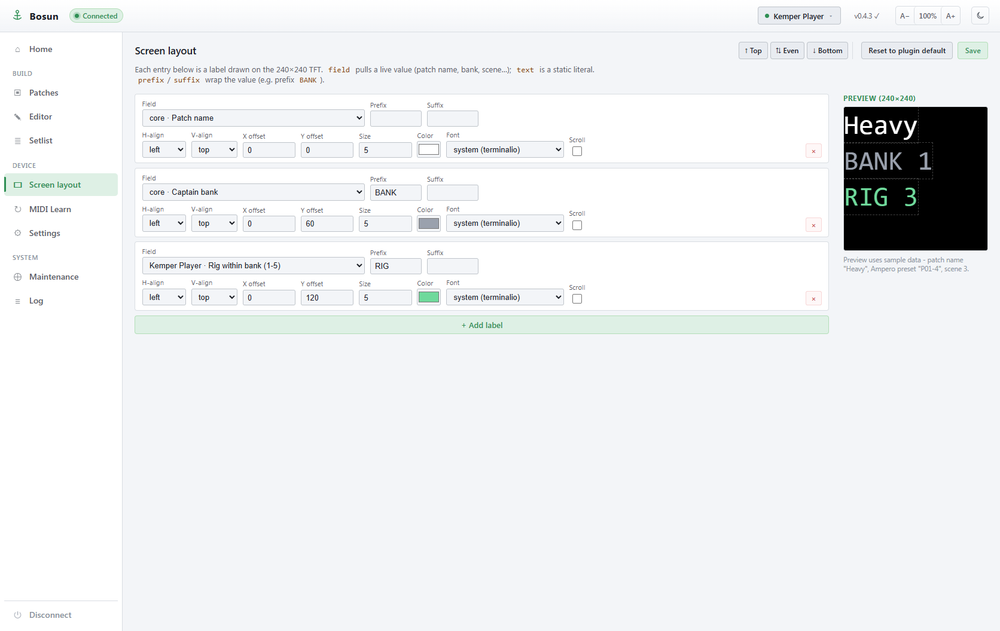

### Settings

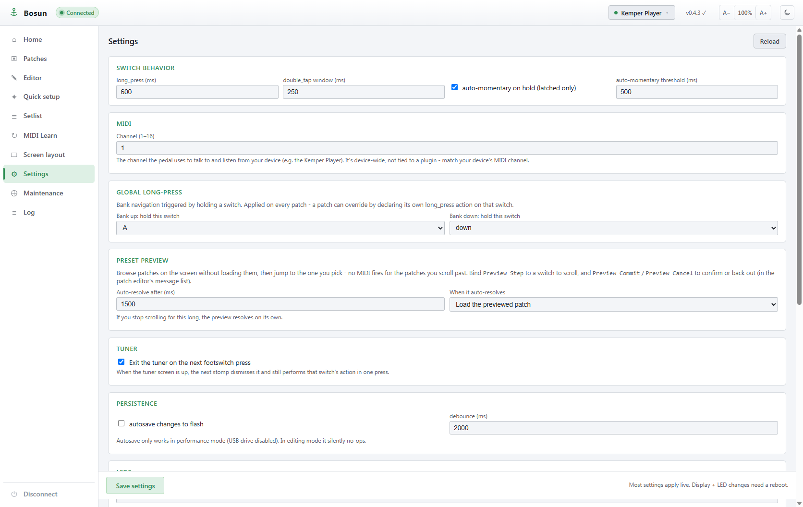

### Maintenance

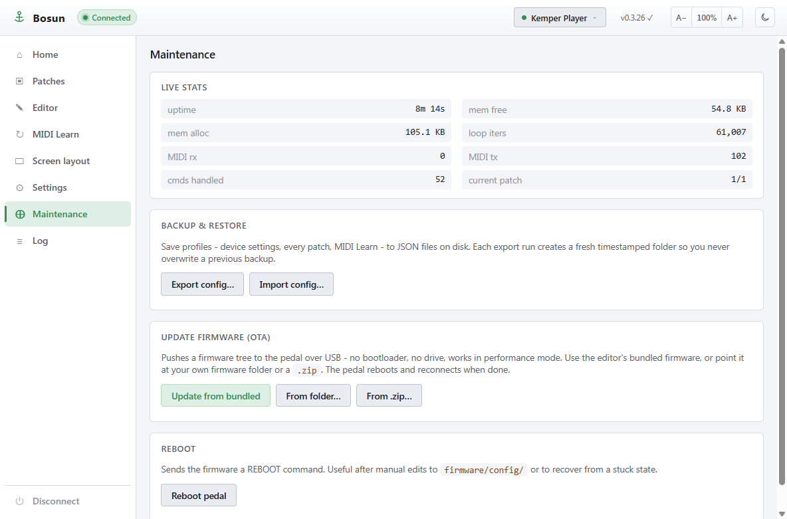

## Stage

Stage shows the current rig, bank, effects and expression mode. With compatible native firmware, tap or click a configured switch tile to operate the pedal.

Use **+ / −** to move between banks, or tap **BANK** to open the bank grid. The selector offers two behaviours:

- **Load rig immediately** changes to the selected bank straight away.
- **Preselect bank** previews that bank while the current sound keeps playing. Tap a rig to load it, or **CANCEL** to leave the preview.

The settings button opens Stage appearance controls for fonts, colours and sizes. Preferences are saved separately in each browser or app.

A Raspberry Pi can show Stage automatically over HDMI. Its browser page also works from another screen on the same network. The optional read-only VNC viewer shows the actual Pi-rendered picture, including when no HDMI screen is connected. Follow the [Raspberry Pi installation and display guide](tools/rpi-hub/README.md).

## Update firmware

1. Export a configuration backup and save all pending edits.
2. Connect the Captain by USB to a configured Raspberry Pi, then connect Bosun Desktop to that Pi.
3. Select **Update Bosun**, review the bundled release and choose **Update**.
4. Keep the Pi and Captain powered until the app confirms completion.

The updater supports native upgrades and migration from supported existing CircuitPython configurations. It checks compatibility before writing firmware, makes a complete recovery backup and verifies the result. Unsupported profiles or configurations stop the update before installation.

Use a current desktop package with its matching Pi hub. Direct desktop USB and Android connections do not perform this update flow. To reopen an update after reconnecting, use **Check Bosun update**; do not start another installation while one is still running. If recovery is required, retain the backup shown by the app.

## Connection help

- **Pedal not found:** use a USB data cable, check power and reconnect it. Close other programs that may hold the same USB connection.
- **Pi not found:** keep the app and Pi on the same local network. Enter the Pi's hostname and port `9876` manually if network discovery is unavailable.
- **No patches:** create a profile and add your first rig.
- **Update unavailable:** connect the desktop through the Pi and check that its update support and the desktop's bundled release are installed.

## License

Bosun is available under [GPL-3.0-or-later](LICENSE).
