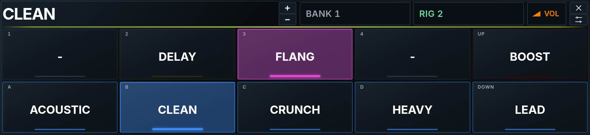
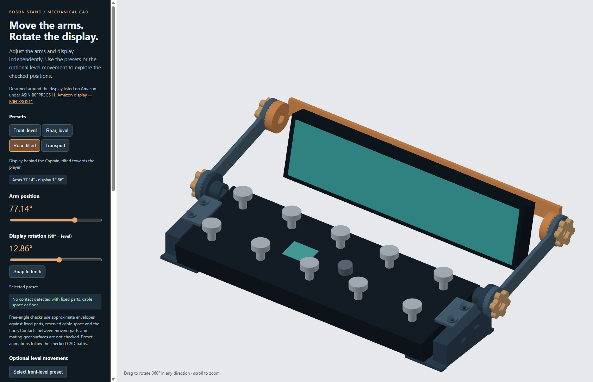

# Bosun: MIDI Captain firmware for Kemper

Bosun is open-source alternative firmware for the **10-switch PaintAudio MIDI
Captain with RP2040 and 8 MiB flash**. Configure footswitches, banks, rigs, LEDs
and expression pedals with Bosun Desktop or Android. The maintained native
firmware supports **Kemper Player, Head, Rack and Stage**, plus **Generic MIDI**.
Kemper support across the family is experimental: Player has previous hardware
validation; Head/Rack/Stage validation is pending. Choose the Player profile or
the shared [PROFILER profile](docs/kemper-head.md) for Head/Rack/Stage.

**Stage** shows rig names, effect states, a tuner and Morph controls on a phone,
tablet, computer or Raspberry Pi display. Android and Desktop can also handle
the MIDI bridge; a Pi shares the Captain connection across the local network.

[Download](#download-and-install) · [Setup and FAQ](docs/first-setup.md) ·
[Connections](#connections) · [Editor](#configure-your-sounds) ·
[Stage](#stage) · [Bosun Stand](#bosun-stand) · [Firmware updates](#update-firmware)

## Download and install

These instructions cover **Bosun 0.7.1**. Download the matching packages from
[GitHub Releases](https://github.com/danmigdev/bosun-midi-captain/releases).
See [what changed in 0.7.1](docs/releases/0.7.1.md).

| System | Package | Installation |
| --- | --- | --- |
| Windows x64 | `Bosun-<version>-portable-x64.zip` | Extract the whole ZIP and run `Bosun.exe`. Requires WebView2. |
| macOS, Apple Silicon (untested) | `.dmg` | Open it and copy Bosun to Applications. |
| Linux x64 (untested) | `.AppImage` | Make it executable, then open it. |
| Android 10 or later | `bosun.apk` | Install the APK; connect over USB-OTG or through a Pi hub. |

**Start with Setup guide in Bosun Desktop**, or follow the
[illustrated setup guide and FAQ](docs/first-setup.md). It covers six
configurations, including Android as hub and a Pi with an HDMI display.
The same wizard is available as an
[offline HTML guide](https://github.com/danmigdev/bosun-midi-captain/releases/download/v0.7.1/Bosun-0.7.1-setup-guide.html).
Keep the app, Captain firmware and Pi components on matching releases.

## Connections

The Captain's USB cable carries MIDI commands/feedback and the Bosun data
connection used by the editor and Stage. Its USB-B port connects to one host:
a compatible Kemper USB host, Android, a computer or a Pi. A USB hub alone does not route MIDI.

Choose the matching [wiring diagram](docs/first-setup.md#1-choose-what-you-want)
before connecting the devices. Select your Kemper model and USB or, for
Head/Rack/Stage, two-way MIDI DIN. The guide covers direct control, Android,
Desktop, a Pi without a display, a Pi with HDMI, and a Pi with wireless Android.
An [editable draw.io overview](docs/diagrams/bosun-connections.drawio) is also
available.

For a Pi connection, choose **Raspberry Pi (network) → Find Raspberry Pi →
Connect** in Desktop or Android. Use the Pi's hostname/IP and port `9876` if
discovery is unavailable. Stage opens in a browser at
`http://YOUR_PI_HOSTNAME:8080/`. For use without a router, configure the
[Pi hotspot](tools/rpi-hub/hotspot/README.md).

## Set up the pedal

### First installation from factory firmware

Connect the Captain directly to the computer and open **Setup guide → Prepare
the Captain → Install native firmware**. Desktop installs the bundled native
release and saves a verified full factory backup first. Create and save a
profile for your Kemper model or a Generic MIDI profile after installation.

Follow the [installation steps](docs/first-setup.md#2-install-native-firmware-on-the-captain)
for model checks, USB bootloader instructions and backup handling. The
[Windows stock-installation test](docs/stock-installation-test.md) records the
tested PaintAudio version and limitations.

### A pedal already running Bosun

Connect over USB or through the Pi, open the saved profile, then edit its
patches and choose **Save**. For older firmware or CircuitPython migration,
follow [Update firmware](#update-firmware).

## MIDI Captain editor: footswitches, banks and rigs

- **Profiles** keep configurations for different devices or setups separate.
- **Patches** assigns switch press, release and hold actions, labels and LED colours.
- **Settings → Banks** controls rigs per bank and the navigation range;
  see [bank layout](docs/bank-layout.md).
- **Quick setup** applies the available recipe for the selected profile.
- **Screen layout** configures the Captain's display fields and colours.
- **Settings** also contains expression pedals and preset navigation.
- **Maintenance → Export config… / Import config…** backs up and restores
  profiles, settings, patches and MIDI Learn data.

Save edits before disconnecting or updating. **Discard** restores the saved
version of pending patch changes.

## Stage: external display for Kemper

Stage follows the playing rig, bank, effects and expression mode. Tap a switch
tile to operate its configured action. Activating the Kemper tuner opens the
fullscreen tuner automatically.

The **Morph bar** shows the last commanded position as **Set**, or **?** when
unknown; it does not measure the Kemper's live Morph position. Its controls
send positions or a Morph Button tap.

Use the dedicated guides for [Stage appearance and tuner](docs/stage-instrument-display.md),
[bank selection and preselection](docs/stage-bank-selection.md), and
[Morph controls and expression pedals](docs/morph.md).
The [Pi guide](tools/rpi-hub/README.md) covers automatic HDMI startup and
viewing the actual Pi display through VNC.

## Bosun Stand

[Bosun Stand](bosun-stand/README.md) is a 3D-printable display stand for the
10-switch MIDI Captain. Its side clamps, articulated arms and adjustable display
mount let you position the screen in front of or behind the pedal, tilt it
towards you, or fold it into the transport position. Arm position and display
angle adjust independently and lock with toothed joints and hand knobs.

The project includes **13 printable parts**, editable CAD sources, STEP models
and an interactive 3D preview. Download the
[print files](bosun-stand/Bosun_Stand_Print_Files.zip), or the
[complete CAD package](bosun-stand/Bosun_Stand_Final_Complete.zip) and open
`preview_3d.html` locally in your browser to explore the positions.
See the [dimensions and assembly guide](bosun-stand/final_stand/README.md)
for the reference display, fasteners and printer requirements. The design has
been checked in CAD; physical fit and load testing remain to be completed.

## Update firmware

Use **Bosun Desktop** with its matching bundled native release. Export a
configuration backup and save pending edits before starting.

| Current installation | Supported path |
| --- | --- |
| Native Bosun connected directly to Desktop | **Update firmware (USB)**, or **Maintenance → Install firmware (USB)** for reinstallation. |
| Native Bosun connected to a Pi | Connect Desktop to the Pi and choose **Update Bosun**. |
| Existing Bosun CircuitPython | Migrate through the Pi using Desktop. |
| Factory firmware | Follow [first installation](#first-installation-from-factory-firmware). |

The [firmware update and recovery guide](docs/firmware-updates.md) is the
reference for USB driver requirements, compatibility, verified backups and
interrupted updates. Keep the Captain and its host powered until completion.
Android provides editing and Stage; firmware installation uses Desktop.

## Help and development

For missing devices, bridge connections, backups and Pi installation, use the
[setup FAQ](docs/first-setup.md#frequently-asked-questions).

| Development task | Guide |
| --- | --- |
| Build Desktop and manage the source checkout | [Desktop build guide](editor/SETUP.md) |
| Build Android | [Android build guide](editor/src-tauri/android-config.md) |
| Build native Captain firmware | [Native firmware](firmware-native/README.md) |
| Install or maintain the Pi services | [Raspberry Pi hub](tools/rpi-hub/README.md) |
| Maintain reproducible Android builds and F-Droid metadata | [Android reproducibility](docs/android-reproducible-builds.md) |

## License

Bosun is available under [GPL-3.0-or-later](LICENSE).
