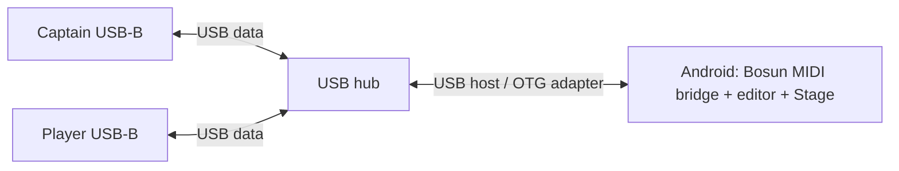
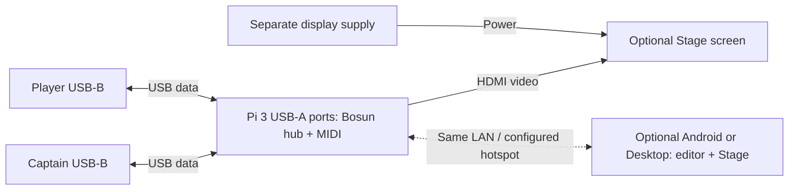

# Bosun: choose your setup

Open **Setup guide** in Bosun Desktop for the interactive version: choose a setup, see its diagram, install the Captain, prepare the host and run the final check. The [0.6.9 release](https://github.com/danmigdev/bosun-midi-captain/releases/tag/v0.6.9) includes `Bosun-0.6.9-setup-guide.html`, which uses the same screens and works offline in a browser. On Windows, `Setup-guide.html` is also beside `Bosun.exe`. To build the guide from source, run `npm --prefix editor run build:guide`.

These instructions target the **10-switch RP2040 MIDI Captain with 8 MiB flash** and **Kemper PROFILER Player**. Other Captain or Kemper models need their own compatibility check. Use **Desktop 0.6.8 or later** for stock PaintAudio 5.15; 0.6.7 cannot discover it. The corrected installer passed a complete Windows installation from 5.15, including configuration restoration. See the [hardware test and release status](stock-installation-test.md). macOS/Linux operation, other stock versions and installation on a fresh Pi card remain unverified.

## 1. Choose what you want

| Setup | What handles MIDI? | Where is Stage? | Must stay running while playing |
| --- | --- | --- | --- |
| Captain directly to Player | Player USB host | Captain display only; no external Stage | Captain and Player |
| Captain + Android + Player | Bosun on Android | Phone/tablet | Android and Bosun |
| Captain + computer + Player | Bosun Desktop | Computer | Computer and Bosun |
| Captain + Pi 3 + Player | Raspberry Pi | Optional app/browser over the network | Pi |
| Pi 3 + HDMI display | Raspberry Pi | HDMI screen, starts automatically | Pi and display |
| Pi + Android over Wi-Fi | Raspberry Pi | Phone/tablet over Wi-Fi | Pi; phone can disconnect |

### Direct to Player

Prepare and save the Captain profile on your computer first. Then move its USB cable to the Player. Reconnect to your computer when you want to edit. Connecting a phone to the Player's other USB port does not expose the Captain's Bosun data connection.

### Android as hub and Stage

Install `bosun.apk` from the latest release. Android 10 or later and USB host/OTG support are required. Accept USB permissions, connect the Captain, check **Bridge ON**, and open **Stage**. Leave Bosun running while playing. Use a powered hub if the phone cannot supply enough power; simultaneous phone charging depends on the phone and hub. The Player uses its own power supply.

For the computer setup, connect both USB-B ports to the computer's USB ports or a hub. Bosun Desktop provides the same MIDI bridge and Stage roles.

### Raspberry Pi, with optional HDMI and wireless Android

Power the Pi and Player with their own supplies. HDMI supplies video, not display power. For touch input, also connect the display's USB touch cable to the Pi; a plain screen only shows Stage. Once configured, the Pi handles MIDI independently of the editing app.

## 2. Install native firmware on the Captain

1. Download the latest complete [Bosun Desktop release](https://github.com/danmigdev/bosun-midi-captain/releases/latest). On Windows, extract the entire folder and open `Bosun.exe`.
2. Connect **Captain USB-B directly to the computer**, using a data cable. This temporary connection is needed even if your final setup uses Android or a Pi.
3. Open **Setup guide → Prepare the Captain → Install native firmware**. Confirm the supported model, selected device and displayed native version, then press **Install**.
4. Bosun saves and verifies the full original firmware and files before writing. Keep the computer and Captain powered and the USB cable connected. The firmware installs directly as native Bosun; no old Bosun or CircuitPython installation is needed.
5. Bosun requests the USB bootloader automatically. Keep the Captain on the **same USB port**. If this fails, follow your current firmware's bootloader procedure. PaintAudio 5 supplies `MIDICAPTAINBOOT.HTML`: open it in Chrome or Edge, choose **BOOT**, and select the Captain serial device. The installer continues when `RPI-RP2` appears. Holding footswitch **1** while powering on opens **USB Setup**, not the ROM bootloader.
6. Wait for **Bosun installed**, close the installer, and connect in the editor. Create a **Kemper Player** profile, assign the footswitches and save.

Factory settings remain in the full backup; they are not translated into Bosun profiles. Already-native devices use **Update firmware (USB)** instead of first installation. Existing Bosun CircuitPython profiles use the existing Pi migration procedure.

## 3. Prepare a Raspberry Pi card, if your setup uses one

You need a Pi 3, its power supply, a microSD of at least 16 GB, a card reader, and a computer. The Pi needs Internet for package installation. These steps use [Raspberry Pi Imager](https://www.raspberrypi.com/software/), following the official [OS installation instructions](https://www.raspberrypi.com/documentation/computers/getting-started.html#installing-the-operating-system).

1. In Imager select **Raspberry Pi 3**, **Raspberry Pi OS Lite (64-bit), Debian Trixie**, and the microSD. Check the card name and capacity: writing erases that card.
2. Set hostname **bosun**, your own username and password, Wi-Fi if needed, and enable **SSH**. Keep a note of the credentials. Ethernet to the router is simplest for initial setup.
3. Write and verify the card. Eject it, insert it into the powered-off Pi, connect its network and power, and let first boot finish. If Windows asks to format a partition, cancel.
4. In Desktop's guide select your Pi configuration and **Prepare the host → Save Raspberry Pi package**. Save the file, enter the username chosen in Imager and `bosun.local` (or the Pi's IP address).
5. Open **PowerShell** on Windows and paste the generated command. It copies the package and runs the installer. Enter your SSH password when prompted; password characters are not displayed. For a first SSH connection, compare the host-key fingerprint with the Pi before accepting it.
6. Wait for **Bosun ready**. Stage is already compiled in the package; you do not need Node, npm or Git on the Pi. Connect Captain and Player to two Pi USB-A ports. If using a screen, connect HDMI and its separate power.
7. In the app choose **Raspberry Pi (network) → Find Raspberry Pi**. For Stage in a browser, open `http://bosun.local:8080/`; replace the hostname with your chosen name or Pi IP if necessary.

The package installs the hub, MIDI bridge and Stage services. It does not flash the Captain, enable a hotspot, or install an early boot logo on a fresh card. Desktop does not yet write the entire card itself. The existing [Pi setup instructions](../tools/rpi-hub/README.md) cover manual installation, optional hotspot and boot branding.

If installation fails, keep the error and check the Pi's Internet connection, username, password and address. The same generated command can be run again. `Bosun ready` means the services started; verify the real screen and MIDI response next.

## 4. Check the result

Press a Captain footswitch assigned to a rig. The Player must change rig, the Captain should receive feedback, and Stage should follow wherever your setup includes it. Test an effect too. Save the profile before unplugging.

For Android or Desktop acting as the MIDI host, check **Bridge ON** and leave Bosun running. For a Pi host, close the remote editing app and confirm the Captain still controls the Player.

## Frequently asked questions

**Can Android replace the Pi?** Yes, with compatible USB host/OTG and a hub. It runs the MIDI bridge, editor and Stage. Firmware installation still uses Desktop. Android does not provide the Pi's network-sharing service.

**Does a USB hub alone route MIDI?** No. It adds USB ports. Android, Desktop or the Pi must run the MIDI bridge. The direct Player USB-A connection uses the Player's USB host instead.

**Can the Captain connect to two USB hosts at once?** No. Choose the Player, Android, computer or Pi as its host. A splitter cannot share the Captain's USB-B data connection. Access a Pi-connected Captain through the Pi network connection.

**Is Internet required on stage?** No, after setup. Network access requires a local network or the separately configured Pi hotspot; it does not require Internet.

**Where is my factory backup?** The installer displays its path and a **Show backup** button. Retain it. If writing was interrupted, reopen Desktop, reconnect the same Captain to the same USB port in BOOTSEL and choose **Restore backup**. The worker verifies the full restored flash; factory firmware does not report its startup status to Bosun.

**The Captain is missing.** Check the cable supports data, close other serial apps and use a direct computer USB connection for installation. Follow the wizard's BOOTSEL instructions if needed. Disconnect unrelated RP2040 boards during installation.

**Stage opens but does not follow the Player.** Check the chosen wiring diagram, the Kemper Player profile and the bridge. Seeing the page alone does not verify the MIDI connection.

For Morph footswitches, expression pedals and the Stage bar, follow the [Morph guide](morph.md).
