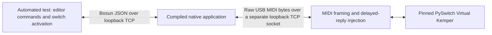

# Kemper integration tests with PySwitch

Bosun's native host application can exchange MIDI with PySwitch's virtual
Kemper without a Captain or a physical Kemper. The adapter is test tooling;
it is not included in the RP2040 firmware or the released apps.



## Run

Install Node.js 22 in the Linux/WSL environment used for native builds, along
with the [native build dependencies](../firmware-native/README.md#build-requirements).
Instead of installing it system-wide, you can unpack the official Linux x64
archive under `firmware-native/.deps/`; CMake uses it when PATH has no `node`.
No npm packages, browser, virtual MIDI driver or network download is needed
for these tests. The reviewed upstream JavaScript subset is stored in the repo.

```bash
bash tools/native-build.sh host --fetch-sdk
```

To rerun just this integration after building:

```bash
ctest --test-dir firmware-native/build-host -R pyswitch --output-on-failure
```

The native CI and release package jobs run the suite too. Every run creates
temporary profile data, starts the actual compiled application, checks its
exit status and sanitizer diagnostics, then removes the temporary data.
It never enumerates physical USB/MIDI devices or flashes hardware.

## Coverage

- Bidirectional initialization and initial rig-name feedback.
- Performance selection across addresses 128/129, 256/257, 512/513 and 625,
  including external selection and feedback without a selection loop.
- Effect commands and feedback for A, Delay and Reverb.
- Rapid Clean → Crunch → Delay, with a real upstream reply held and delivered
  late to exercise reconciliation.
- Tuner state/note messages and commanded Morph position.
- MIDI disconnect, lease expiry, reconnection and partial-packet isolation.
- Player's distinct product ID using the same virtual model.
- Unsolicited context messages used by Bosun Stage. This checks the data sent
  to Stage; it does not render or visually inspect the Stage UI.

The adapter handles fragmented SysEx, running status and interleaved realtime
bytes. The native application is also exercised with one-byte I/O chunks.

## Limits

These checks establish compatibility with this simulation, not with every
Kemper model or OS. Head/Rack/Stage remain experimental pending hardware tests.
The simulator uses MIDI channel 1 and does not provide independent models of
each hardware generation. Browse assignments, MK1/MK2 capability differences,
looper behavior, real Morph ramps and physical USB/DIN timing are not validated
by this suite; Bosun's existing unit tests continue to cover its own encodings.

PySwitch automatically creates unknown parameters. The adapter records those
separately, and test assertions can only retrieve parameters explicitly defined
during model initialization. A synthesized parameter is not accepted as proof
of feature support. Upstream warnings and errors fail integration tests.
The virtual rig model also does not reproduce a real device's complete per-rig
snapshot or response timing; delayed replies are an explicit test injection.
Delay and Reverb are absent from its automatic feedback parameter sets, so
their command tests explicitly emit the model's current value after checking
the received command. This covers encoding and incoming feedback separately;
it does not verify automatic feedback from those effects on hardware.
Its tuner-note timer starts only for the on value 1, while Bosun sends 127.
It also echoes that raw CC value as a numeric parameter, whereas Bosun expects
the tuner-state numeric parameter to be 1 for on.
The tuner test verifies that command separately, then uses an explicit external
virtual tuner change to start note feedback. The adapter does not normalize
the command or modify upstream behavior to conceal this limitation.

## Upstream source

The unmodified files in `firmware-native/tests/pyswitch/upstream/` come from
[Tunetown/PySwitch](https://github.com/Tunetown/PySwitch/tree/30e923f17d31714038ec21f6245337a71711bc6f/web/htdocs/clients/kemper/virtual),
commit `30e923f17d31714038ec21f6245337a71711bc6f`. Their paths and SHA-256 hashes
are recorded in `manifest.json` and verified before the model is loaded.
The upstream copyright and GPL-3.0-or-later notice are retained in `LICENSE.md`;
the full GPL text is in Bosun's root `LICENSE`.

When updating the model, review changes at a new explicit commit, refresh the
files and hashes together, and rerun the suite. Do not silently change the
simulation to match Bosun's responses.
