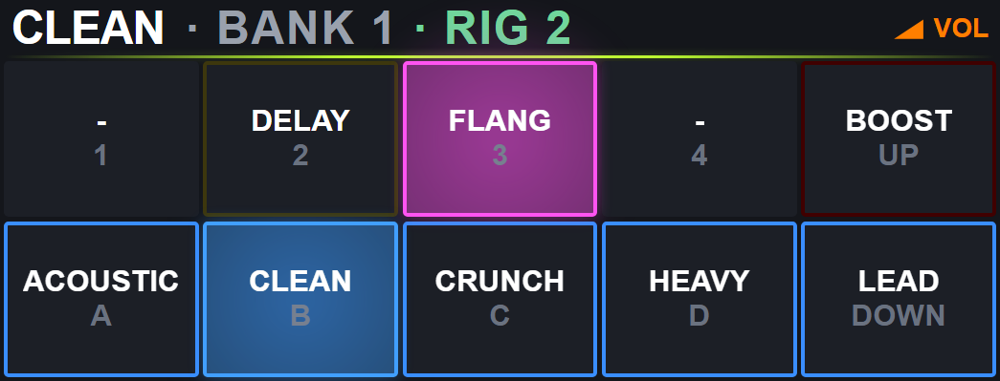

# Native Captain hardware evidence, 2026-09-05/06

**Native firmware remains experimental and has not passed final hardware acceptance.**
Candidate 06 passed its USB baseline, bounded bank transitions, persistence
and browser checks. Concurrent traffic still timed out; candidate 07 added
diagnostics and reproduced a missing request before application receipt.
These results do not support replacing the working CircuitPython installation
for normal use.

The tested candidate-06 UF2 has SHA-256 beginning `425ece31`. Installation
was verified after the Pi became reachable again on September 6. The cause
of the preceding loss of SSH, HTTP and neighbor reachability remains undetermined.

## Measured USB performance

The same Captain, Raspberry Pi 3 and Kemper were used for CircuitPython
9.2.7 / Bosun 0.6.4 and native. Each direct data-CDC baseline used two warmup
rounds and 30 sequential samples per command. The hub released the serial
port while ALSA MIDI routing remained available.

| Command | CircuitPython median / p95 (ms) | Native 06 median / p95 (ms) | Median ratio, CP / C |
| --- | ---: | ---: | ---: |
| `PING` | 83.50 / 94.75 | 4.88 / 6.16 | 17.1 |
| `GET_CONTEXT` | 110.22 / 117.68 | 18.79 / 20.07 | 5.9 |
| `GET_GLOBAL` | 2281.27 / 2315.93 | 52.59 / 54.44 | 43.4 |

These are host request-to-response times, including scheduling, USB transport
and firmware processing. They do not measure physical footswitch-to-MIDI
latency, TFT pixels, boot time or isolated CPU execution. No hub cache served
the direct reads; the context schemas differ.

Global configuration was equal as parsed JSON. Replies contained 2,215–2,216
bytes for CircuitPython and 2,233–2,234 for candidate 06. Native's earlier
candidate-03 reply was about 2,508 bytes before a persistence rewrite compacted
the JSON: timing changes between native candidates also include serialization
size, not just executable changes.

Both baselines preserved configuration and reported no counter growth or
uptime reset. Both selected the original CRUNCH bank 1 / rig 3. Their complete
durations were 90.61 seconds and 2.79 seconds respectively; equal sample counts
do not establish equal-duration stability.

## Completed checks and limits

| Candidate 06 check | Recorded result |
| --- | --- |
| Direct bank navigation | 12 confirmed transitions across all six stored patches in banks 1 and 2; original rig restored; counters unchanged |
| Configuration persistence | One color-bit change, exact JSON readback, normal reboot/readback, then original JSON restore and another reboot/readback; both globals, six patches and TFT projections matched |
| CDC reconnect | 20 sessions passed after explicitly selecting CRUNCH 3; an earlier run's fixed rig-3 assertion failed because its actual starting rig was ACOUSTIC 1, consistently reported with matching Kemper coordinates in all 20 sessions |
| Browser Stage | Three rig cycles, three external X-block OFF/ON cycles, five cold loads with CLEAN effect checks, nine viewport layouts passed |
| First concurrent stress | Bank client failed after 30 completed transitions in 59.41 seconds: `GET_RIG_INFO` timeout and `protocol_errors +1`; bulk client failed `GET_GLOBAL` at 23.88 seconds |
| Instrumented rerun | Bank client passed 99 confirmed transitions within its 160-second measurement budget, 162.81 seconds including setup/cleanup; concurrent bulk client failed `PING` at 126.76 seconds after 545 samples of each command; counters unchanged in both reports |
| 600-second endurance acceptance | Not passed; the first run failed early, and the shorter diagnostic rerun also had a bulk timeout |

Stage's five cold-load navigation times were 3,407, 875, 891, 875 and 859 ms;
the first overlapped the read-only layout test. Effect checks required 500 ms
of stable state. During active tests, correlated context, the
Captain's submitted LED frame and browser DOM agreed, with one stable change
per external effect edge. Submitted LED data does not measure emitted light.
The harness checks these saved ACOUSTIC/CLEAN rigs, the five known navigation
labels, B/R or BANK/RIG header prefixes, and MIDI channel 1. It does not prove
correctness for arbitrary user names, prefixes or all 16 MIDI channels.

The screenshot was recaptured from the connected candidate-06 devices; its
pixels are unchanged from the same candidate-05 view. After this capture, the private
restore tool confirmed the original bank 1 / rig 3 and fresh matching Kemper
rig information. This records the state at the end of the Stage test, not a
promise about device state after subsequent diagnostics.

## Candidate 07: receive-path diagnosis

The installed diagnostic UF2 has SHA-256 beginning `8581f485`. Its intended
600-second bulk run failed after 49.46 seconds, with 156 `PING`, 155
`GET_CONTEXT` and 155 `GET_GLOBAL` samples. The bank client failed after
17 confirmed transitions in 39.45 seconds. Both timed out on the same
coalesced hub `GET_CONTEXT`, representing one missing request. Error counters
did not grow, and the bank client's original-rig restoration passed.

The capture contains 19,424 USB records with zero reported capture drops,
854 host CDC requests and 960 device JSON frames. One 63-byte `GET_CONTEXT`
has a successful host OUT completion but no response. In the DTR-anchored
session, removing only those 63 bytes from the host request stream makes its
byte counts and FNV-1a fingerprints match all 39 application RX checkpoints.
All 39 TX checkpoints match the unmodified captured reply stream.

This localizes the observed gap between host OUT completion and
`tud_cdc_n_read`, before the application parser. USBmon observes the host
driver, not a physical USB analyzer; 32-bit fingerprints and byte counts are
not an internal byte capture. The responsible controller, interrupt or CDC
stage remains unresolved. Further DCD/CDC instrumentation is diagnostic work,
not a demonstrated fix or a performance result.

## Memory evidence

| Candidate 06 linker audit | Bytes |
| --- | ---: |
| Static RAM | 234,260 |
| Reserved stack | 16,384 |
| Unused RAM margin | 19,692 |
| Flash program image | 159,616 |

Candidate 07's diagnostics increase static RAM to 234,388 bytes, leaving
19,564 bytes after the same stack reservation; its flash image is 160,108 bytes.

No dynamic allocator symbols were linked. The Captain executes native code
without CircuitPython or its garbage-collected heap, but static RAM remains
heavily occupied. The margin is not a measured stack high-water mark.

CircuitPython's baseline `mem_free` readings were 6,952–6,984 bytes. These are
sampled heap values, not total physical free RAM or a maximum contiguous
allocation. Comparing them directly with the native linker margin would not
measure a memory saving. Native `STATS` provides no equivalent heap or live
stack-headroom measurement.

## Backup and exact rollback

Before installation, all **8 MiB of physical flash** were read and verified
with `picotool save -a -v`. A second local copy matched SHA-256; the recovery
UF2 was checked page by page against the full binary. Configuration was also
preserved through file extraction and protocol snapshots.

The original FAT volume spans `0x100000..0x800000` (7 MiB). Native littlefs
uses `0x780000..0x800000` (512 KiB), **inside that FAT volume**. Its 512
destination clusters were free in the captured FAT, but native installation
still changes their bytes. Exact rollback requires the complete saved 8 MiB
image, including the filesystem; a generic CircuitPython UF2 is insufficient.

On September 6, the complete original image was actually restored and
verified over all 8 MiB. After reboot, the read-only protocol comparison passed:
both `GET_GLOBAL` objects, all six `GET_PATCH` objects, firmware `0.6.4` and the
active profile matched the original snapshot. This establishes the completed
flash rollback and configuration readback, with the live tests below recorded
separately.

Before that rollback, candidate 06 was also backed up as a verified
8,388,608-byte image, SHA-256 beginning `15e33b40`, preserved on both the Pi
and the PC. The images, identity-checked restore script and machine-specific
instructions remain private; raw snapshots and device identifiers are not
included in this documentation.

## Restored CircuitPython control

With the original firmware restored, the hub bulk client completed its
300-second measurement budget: 110 `PING`, 110 `GET_CONTEXT` and 109
`GET_GLOBAL` replies, with no `usb_tx_dropped` growth. Total runtime including
setup and final reads was 312.54 seconds. Its last `GET_GLOBAL` was cut off
by the remaining 0.74-second overall budget, recorded as censored rather than
an eight-second response timeout.

The concurrent bank client failed at 48.81 seconds after one confirmed
transition, and its automatic restoration confirmation also timed out.
The USB capture contains replies to all 401 captured CDC requests, with no
malformed JSON. The two timed-out context replies arrived after 2.221 and
2.355 seconds, exceeding their remaining confirmation budgets of 1.489 and
0.792 seconds. MIDI also shows the final Kemper rig selections arriving while
CircuitPython context retained the intermediate rig coordinates. These are
observed state and deadline failures, without a missing CDC reply in this
capture. Its 401 requests and lower throughput do not establish equivalent
load or absolute reliability against the 3,400-request native-06 trace.
The successful configuration comparison above preceded these navigation tests.

## Findings retained for review

- DIN UART transmission stalled when interrupts were enabled on an empty
  FIFO. The producer now primes the FIFO before interrupt-driven draining.
- CDC close/reopen handling now separates sessions and queued traffic.
  Serial-open input flushing can still discard an initial prefix; bounded
  PING synchronization records startup fragments, followed by strict parsing.
- Candidate 02 failed rig/name correlation. Candidate 03 passed the 15-target
  bank-1 sequence but mishandled an intermediate bank-change Program Change.
  Its 601.25-second endurance test failed with `storage_errors +2`.
- Candidate 04 passed short boundary tests but two concurrent clients rejected
  malformed JSON. An instrumented rerun passed 80 bank changes and 201 seconds
  of bulk traffic; the first 2.727 MB of USB and serial captures matched.
  The capture tool later reported 44,647 dropped capture packets, which are
  not evidence of Captain packet loss. The corruption's cause remains unproven.
- Candidate 05 preserves queued CDC data and session identity during USB
  suspend. That correction does not prove it caused or resolved candidate
  04's JSON failure. Candidate 05's longer bank stress failed after 25
  transitions with a timeout and `storage_errors +1`. Its final bulk artifact
  was recovered empty; the console contained 549 seconds of valid observations
  followed by a NUL tail, and the ALSA capture ended mid-record. Those partial
  captures cannot establish an endurance pass or diagnose the loss of Pi access.

Candidate 06 extends the fixed bank-snapshot window from 1 to
2.5 seconds and accepts a late final PC after fallback unless a newer selection
has superseded it. Successful candidate-04 USB captures already approached
the original one-second limit. Offline tests cover 1.1/2.4-second confirmations,
fallback, timer wrap and superseding selections; all 22 host suites passed.
This change fixes a reproducible delayed-echo case in tests; it does not
establish the cause or resolution of candidate 05's hardware failure, and
candidate 06's real bulk timeouts remain unresolved.

Commit `9e97cd2`, including the candidate-07 diagnostics, passed
[native GCC/Clang sanitizers and ARM image checks](https://github.com/danmigdev/bosun-midi-captain/actions/runs/34017142235)
and [CircuitPython, hub, editor, Rust and Android CI](https://github.com/danmigdev/bosun-midi-captain/actions/runs/34017142213).
These checks coexist with the hardware failures above. Further bank-transition
diagnosis, a completed clean endurance run, and direct switch/pedal and display
observations remain necessary.

Reproduction tools:
[`live_hardware_benchmark.py`](../firmware-native/tests/live_hardware_benchmark.py)
and [`live_native_persistence.py`](../firmware-native/tests/live_native_persistence.py).
Both default to reads. Private artifacts retain command correlation, recent
context/rig/error replies and malformed wire data without tolerating session corruption.

Source artifacts remain local: `cp-usb-baseline.json`, `cp-usb-rigs.json`,
`native06-usb-baseline-crunch.json`, `native06-usb-banks.json`,
`native06-persistence.json`, `native06-cdc-reconnect20*.json`,
`native06-hub-banks-stress.json`, `native06-hub-soak600.json`,
`native06-usb-captured-{banks,bulk}.json`, `native06-stage-*.txt`,
`native06-stage-original-rig-restored.json`,
`candidate-06/bosun_native-memory.json`, `backup-verification.json` and
`native-storage-fat-overlap.json`; earlier failed-candidate artifacts are
retained privately as well. Rollback/control evidence is in
`resume-cp-restore.log`, `native06-full-backup.json`,
`cp-restored-config-compare.json`, `cp-restored-hub-soak300.json` and
`cp-restored-hub-banks-stress.json`; `cp-restored-usb-analysis.json` and
`cp-restored-midi-timeline.json` retain the capture analysis.
Candidate-07 evidence is in `native07-hub-soak600.json`,
`native07-hub-banks-stress.json`, `native07-usb-capture.log`,
`native07-fingerprint-final.json` and `native07-missing-request-analysis.json`.
