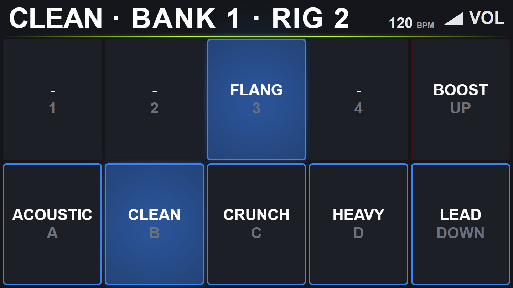

# bosun-hub

The Raspberry Pi appliance service. It owns the single connection to the
MIDI Captain's data USB-CDC port (the Bosun line-JSON protocol) and fans
it out to:

| Endpoint | Default | For |
|---|---|---|
| raw TCP | `:9876` | the editor, via its existing `tcp_connect` (`tcp://<pi>:9876`) |
| WebSocket | `:8081` | the on-Pi Stage kiosk browser |
| static HTTP | `:8080` | the built Stage kiosk bundle |
| UDP discovery | `:9877` | find the hub's hostname and configured TCP port on the local network |

MIDI routing between the Captain and the Kemper Player is **not** done
here. That is a kernel-level ALSA sequencer connection (a udev +
`aconnect` rule), with no userspace process in the audio-critical path.
This service only carries the protocol/state channel that feeds the
display and the editor.

See `docs/plans/20260904_112618_rpi3_midi_hub_stage_display.md` for the
full design.

## Run

Auto-detect the Captain and serve the kiosk bundle:

```
python -m bosun_hub --stage-dir /opt/bosun-hub/stage
```

Point at an explicit port:

```
python -m bosun_hub --target /dev/ttyACM1
```

## Find the hub on the local network

The hub listens for discovery on UDP **9877**, using the same `--host`
interface as its TCP, WebSocket and HTTP endpoints (`0.0.0.0` by default).
The discovery port is fixed; `--tcp-port` controls the TCP port advertised in
replies. If a firewall is enabled, allow inbound UDP 9877 and the configured
TCP port from the editor's local network. Broadcast discovery stays on the
local subnet and may be blocked by guest Wi-Fi/client isolation or a VPN.

The editor sends a small UTF-8 JSON datagram:

```json
{"type":"BOSUN_DISCOVER","version":1,"nonce":"unique-request-token"}
```

The hub replies by unicast to that sender's address and source port:

```json
{"type":"BOSUN_HUB","version":1,"nonce":"unique-request-token","name":"bosun-hub","tcp_port":9876}
```

Requests are limited to 512 bytes and require a nonempty string nonce of at
most 64 characters. The nonce is returned unchanged; clients use it to match
their current search. Discovery only identifies the hub and sends no Captain
commands, so it also works while the Captain is disconnected. It does not
confirm that the pedal itself is ready.

If UDP 9877 cannot bind, the hub logs a warning and continues serving TCP,
WebSocket and Stage. Manual connection remains available at
`tcp://<pi-address>:9876` (or the configured TCP port), including on networks
where broadcast discovery is unavailable.

## Develop without a Pi or a pedal

```
python tools/tcp_firmware_emulator.py                 # terminal 1
cd tools/rpi-hub
python -m bosun_hub --target tcp://127.0.0.1:9876 \   # terminal 2
    --tcp-port 9899 --ws-port 8081 --http-port 8080
```

Then connect the editor to `tcp://127.0.0.1:9899`, or open a WebSocket to
`ws://127.0.0.1:8081`.

## Test

```
cd tools/rpi-hub
python tests/test_hub_e2e.py
python tests/test_context_single_flight.py
python tests/test_patch_single_flight.py
python tests/test_request_correlation.py
python tests/test_server_smoke.py
# or, if pytest is available:
python -m pytest -q
python -m pytest -q tests/test_discovery.py tests/test_server_smoke.py
```

The tests use `tests/fake_pedal.py`, a controllable TCP fake of the data
port (pushable CONTEXT lines, forced disconnects), so link sync, backlog
discard, keepalive, reconnect, fan-out and concurrent GET_CONTEXT/GET_PATCH
single-flight routing, plus colliding TCP/WebSocket request ids and bounded
cleanup, all run with no hardware.

## Deploy only the hub Python service

From Windows PowerShell, test and deploy only `bosun_hub/*.py` to the configured
`bosun-hub` SSH host:

```powershell
powershell -NoProfile -ExecutionPolicy Bypass -File .\tools\rpi-hub\deploy-hub.ps1
```

The helper runs the complete local hub pytest suite first. It uploads a
basename-only module inventory to a unique, validated `/tmp` directory, checks
every SHA-256 and runs remote `py_compile`, then performs a same-filesystem
atomic directory exchange under `/opt/bosun-hub`. The old package remains as a private
backup until two independent health gates have verified the installed hashes,
an active and stable `bosun-hub.service` (`MainPID` and `NRestarts`), and a
correlated protocol `PING`/`ACK` through TCP port 9876. A restart or health
failure automatically restores the previous package and restarts it.
The installed package is root-owned and read-only to the service account, so
runtime bytecode caches or modified executable modules cannot bypass the exact
inventory check.
An exclusive, root-owned journal at `/var/lib/bosun-hub-deploy/lock` prevents
overlapping deploys and retains the exact old/candidate directory identities
if the client or SSH session is interrupted. The preflight also requires the current
service and Captain protocol link to be healthy; this narrow updater therefore
fails before changing code when the baseline is already down.

This narrow deploy does not install packages or units and never changes the
Stage bundle, configuration, kiosk, MIDI routing, or Captain firmware. Useful
offline commands are:

```powershell
# Validate files and show the transaction without SSH. Tests still run.
powershell -NoProfile -ExecutionPolicy Bypass -File .\tools\rpi-hub\deploy-hub.ps1 -DryRun

# Explicitly skip pytest, for a repeat deploy after the identical tree passed.
powershell -NoProfile -ExecutionPolicy Bypass -File .\tools\rpi-hub\deploy-hub.ps1 -SkipTests

# Exercise dry-run validation, rollback guards, and mocked TCP health checks.
powershell -NoProfile -ExecutionPolicy Bypass -File .\tools\rpi-hub\tests\test_deploy_hub.ps1
```

## Deploy only the Stage bundle

From Windows PowerShell, build and deploy only the static Stage kiosk to the
configured `bosun-hub` SSH host:

```powershell
powershell -NoProfile -ExecutionPolicy Bypass -File .\tools\rpi-hub\deploy-stage.ps1
```

The helper validates `index.html` and every local asset it references, uploads
to a unique staging directory, verifies SHA-256 hashes and the remote diff,
then makes `index.html` visible only after the new assets are present. Finally,
it restarts only `bosun-kiosk.service` and waits until Chromium is visible in
that service's cgroup. A missing/inactive kiosk is reported as a deploy failure;
the hub and kernel MIDI routing are never restarted or stopped by this helper.

Useful safe variants:

```powershell
# Offline check of an existing bundle: no SSH connection is attempted.
powershell -NoProfile -ExecutionPolicy Bypass -File .\tools\rpi-hub\deploy-stage.ps1 -ValidateOnly -SkipBuild

# Deploy an already-built editor/dist-stage without rebuilding it.
powershell -NoProfile -ExecutionPolicy Bypass -File .\tools\rpi-hub\deploy-stage.ps1 -SkipBuild

# Run the helper's offline regression test.
powershell -NoProfile -ExecutionPolicy Bypass -File .\tools\rpi-hub\tests\test_deploy_stage.ps1
```

## Deploy Captain firmware through the Pi

`deploy-captain.ps1` is deploy-only: build and test the CircuitPython `.mpy`
artifacts first. It validates the sole USB device as Captain `239a:80f4`, stops
`bosun-hub.service`, and first requires a protocol PING directly on data port
`/dev/ttyACM1`. A healthy Captain is deployed without any preliminary reset.
Only when that PING fails does the helper use console `/dev/ttyACM0` to arm
`RunMode.NORMAL` and perform one bounded microcontroller reset. It never calls
bus-level `usbreset`, which can itself send the RP2040 into `HARD_FAULT` safe
mode and remove ACM1. Missing ports report console/data presence and
`supervisor.runtime.safe_mode_reason`. It then runs the existing transactional
`push_firmware.py`. Remote traps and an independent PowerShell `finally`
restore the hub and require both the Captain ports and complete TCP runtime,
so an active service with a missing Captain is never reported as healthy.
For a multi-file update the uploader installs core/plugin dependencies first,
then `lib/captain/app.mpy`, and `code.py` last. Individual files are verified
and committed independently, so the overall update is deliberately **not
atomic**: power or USB loss between commits can leave a mixed version. In that
case restore stable power and rerun the same complete file set. A successful
deploy is reported only after the hub TCP route completes its runtime bootstrap
checks, not merely after a firmware PING.

Preview the exact remote transaction without contacting the Pi:

```powershell
powershell -NoProfile -ExecutionPolicy Bypass -File .\tools\rpi-hub\deploy-captain.ps1 `
  -DryRun `
  -Files "lib/captain/protocol.mpy,lib/captain/manifest_dynamic.mpy"
```

Run that partial deployment after the dry-run succeeds:

```powershell
powershell -NoProfile -ExecutionPolicy Bypass -File .\tools\rpi-hub\deploy-captain.ps1 `
  -HostName bosun-hub `
  -Files "lib/captain/protocol.mpy,lib/captain/manifest_dynamic.mpy"
```

Omit `-Files` to deploy the complete firmware tree except user-owned `config/`.
The helper refuses malformed paths, non-CircuitPython `.mpy` files and `.mpy`
artifacts older than their source. Run its hardware-free regression test with:

```powershell
powershell -NoProfile -ExecutionPolicy Bypass -File .\tools\rpi-hub\tests\test_deploy_captain.ps1
```

## Browser Stage



Stage is available at `http://<hub-host>:8080/` from a browser on the same network.
This 1440 × 810 capture uses the production Stage bundle with simulated
pedal/Kemper data: CLEAN (bank 1, rig 2), FLANG on, BOOST off, and expression
mode VOL. The screenshot was captured without connected hardware.

## Captain TFT and expression indicator regression

Stage viewport/border, title separator and expression indicator geometry are
tested in real Chromium, including portrait/landscape and active animation:

```powershell
# First terminal, inside editor/: npm run stage:preview
python tools/rpi-hub/tests/browser_stage_layout.py
# Read-only check against the deployed Stage (no rig/effect commands):
python tools/rpi-hub/tests/browser_stage_layout.py --page http://192.168.1.91:8080/ --live
```

The TFT regression has a hardware-free allocation-pressure test:

```powershell
python tools/display_test.py
```

It reproduces the former missing BANK/RIG rows, checks retained labels across
1,000 rig changes, and covers layout failures, scrolling, tuner, preview and
the independently positioned pedal badge. The old renderer caught `MemoryError` for each
label and installed the resulting incomplete frame. The retained system-font
renderer uses the built-in glyph atlas and retries transient allocation errors.

With Captain and Kemper connected to the running RPi hub, these opt-in tests
change the live rig/effect and restore their initial state:

```powershell
Get-Content tools/rpi-hub/live_tft_stress.py -Raw | ssh bosun-hub python3 - --cycles 30
Get-Content tools/rpi-hub/live_wah_stress.py -Raw | ssh bosun-hub python3 - --cycles 5
```

The first passively captures the Captain console while checking rig state.
It fails on memory/render/send errors or increased MIDI TX drops. It does not
measure physical TFT pixels; visually check the screen after deployment too.
The second uses independent ALSA capture of the Kemper fixed-Wah parameter
(page 5, address 21 decimal) and the types/states of the effect slots while
comparing Captain `expression_mode`. The fixed block responds to reads but
did not broadcast its NRPN changes in the tested Player, so the firmware
periodically queries it after rig settling. `WAH` means a confirmed active
fixed Wah or Wah-family effect in a slot; `VOL` requires confirmed absence of
active Wah in both sources. This is not a verification of the Kemper's
WahPedal-to-Volume routing option. Unknown state is displayed as `---`.

On the TFT the indicator is an ordinary `tft.layout` entry with
`field: "expression_mode"`, not a title overlay. New Kemper layouts place it
bottom-right (`x: -6, y: -6, halign: "right", valign: "bottom", size: 2`).
Existing layouts remain unchanged unless explicitly edited; the Screen editor
has an **Add pedal indicator** button. The title retains its configured width
and size. Stage independently displays the same confirmed mode at the right
of its title bar.

## Dependencies

`pyserial` and `websockets`. On Raspberry Pi OS install them as system
packages, no venv:

```
sudo apt install python3-serial python3-websockets
```

## Layout

```
bosun_hub/
  link.py     single-threaded owner of the data port: candidate discovery,
              PING/ACK sentinel sync, stale-backlog discard, keepalive,
              stall detection, hard reopen (ported from the Android
              serial backend's proven shape)
  hub.py      fan-out between the link thread and asyncio subscribers,
              bounded queues, generic per-client request-id isolation,
              correlated GET_CONTEXT and keyed cached GET_PATCH
              single-flights, HUB link-status frames
  server.py   the raw TCP / WebSocket / static HTTP front-ends
  __main__.py CLI
tests/
  fake_pedal.py       controllable data-port fake
  test_hub_e2e.py     link + hub behaviour
  test_context_single_flight.py concurrent snapshot routing + recovery
  test_patch_single_flight.py keyed patch routing + cache/recovery
  test_request_correlation.py colliding raw/WS ids + bounded cleanup
  test_server_smoke.py all three front-ends at once
```
